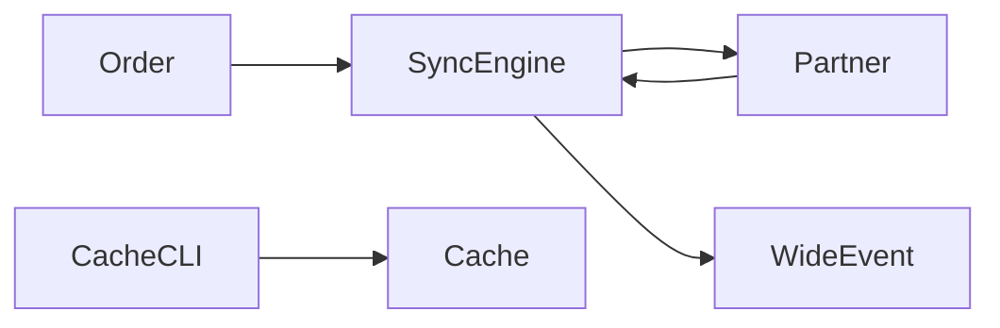

# Design — order sync

## Overview

The sync engine takes a confirmed Order, serializes its Lines, POSTs them to the
fulfillment partner, stores the returned tracking id, and emits one Wide event.
A CLI purges the local cache of partner responses.

## Components

| Component | Location | Purpose |
|---|---|---|
| Sync engine | `src/sync.py` | Serialize and POST an Order; store the tracking id. |
| Retry policy | `src/retry.py` | Exponential backoff for 5xx; no retry for 4xx. |
| Cache CLI | `src/cli.py` | Purge the local sync cache. |

## Sync flow

The engine serializes each Line, POSTs the batch, and on success stores the
tracking id and emits the Wide event `order.synced`.

## Error handling

A 5xx push retries with exponential backoff (see `src/retry.py`); a 4xx marks the
Order sync-failed at once.

## Cache CLI

`cli.py purge` clears the cache. The command takes no arguments.
