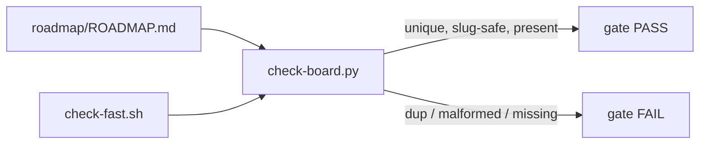

> **Status:** In progress (2026-06-25) — tracked on the [board](../../ROADMAP.md).

# Design

## Decisions

- **Markdown column, not YAML.** The board stays the markdown file (`board.sh` renders
  it). Add `Id` as the first card column: `Id | Work | Status | Spec | Depends on`. A
  parser is structured enough; YAML would split data from view and break `board.sh`.
- **Enforce with a gate lint, not prose.** `scripts/check-board.py` runs in `check-fast.sh`
  (and so on pre-push and CI), mirroring `knowledge.py` + `test_knowledge.py`.
- **Presence scoped to claimable cards.** Uniqueness and slug-safety apply to every id;
  presence is required only for Ready / In progress / Validating — no history backfill.
- **Ships to consumers.** `check-board.py` + `test_check_board.py` are verbatim templates;
  the seed ROADMAP carries the `Id` column; the bootstrap gate includes the board check.

## Mechanism

`check-board.py` finds every card table (a header naming Id, Work, Status), then for each
row classifies the `Status` cell (leading `*` and whitespace stripped) as claimable when it
starts with `ready` / `in progress` / `validating`. It collects ids across all tables and
fails on a missing Id column, a duplicate id, a non-slug-safe id, or a claimable card with
an empty id. `board.sh` is unaffected — it counts rows per section, not columns positionally.

## Metrics

Discrimination, not green-ness: `test_check_board.py` seeds a duplicate id, a missing id on
a claimable card, a malformed id, and a missing Id column — **each must make the lint exit
non-zero**, and a clean board must pass. Runtime is trivial (single file parse); perf N/A.

## Out of scope

`Depends on` id-resolution and existing-consumer migration are follow-ups (see
requirements).
