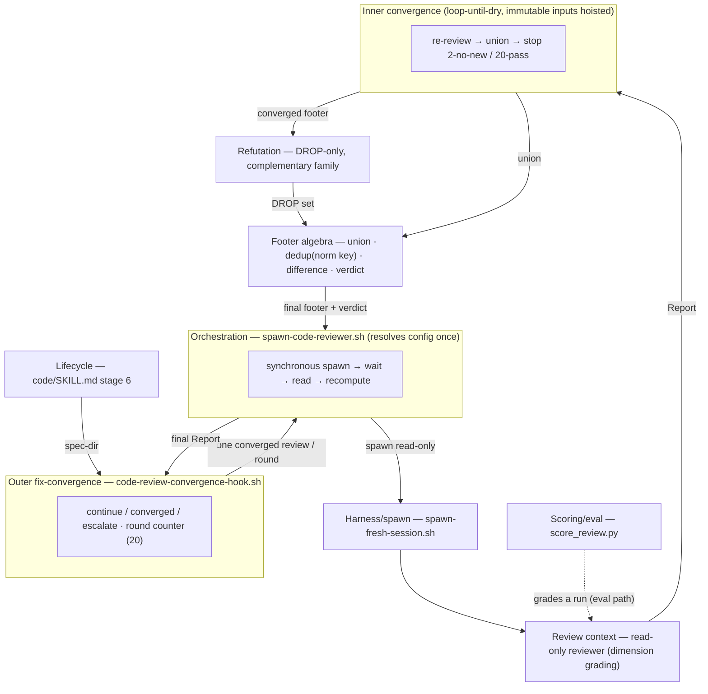
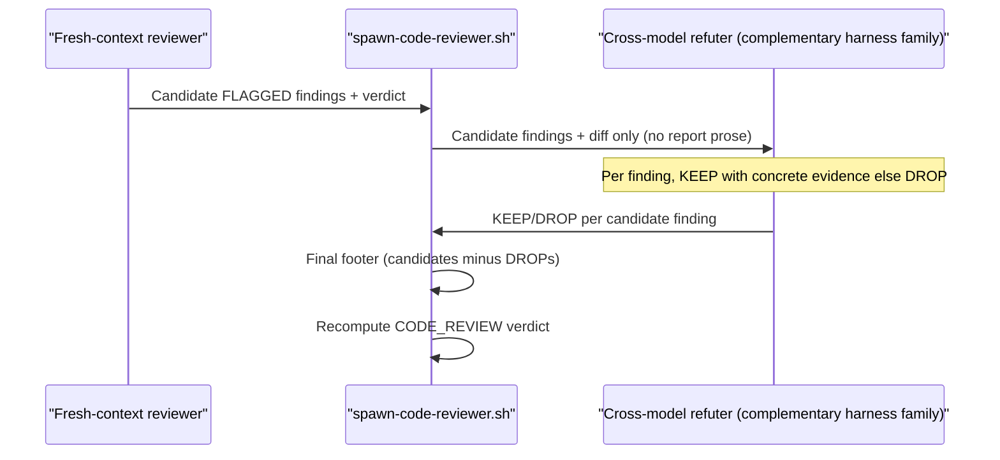
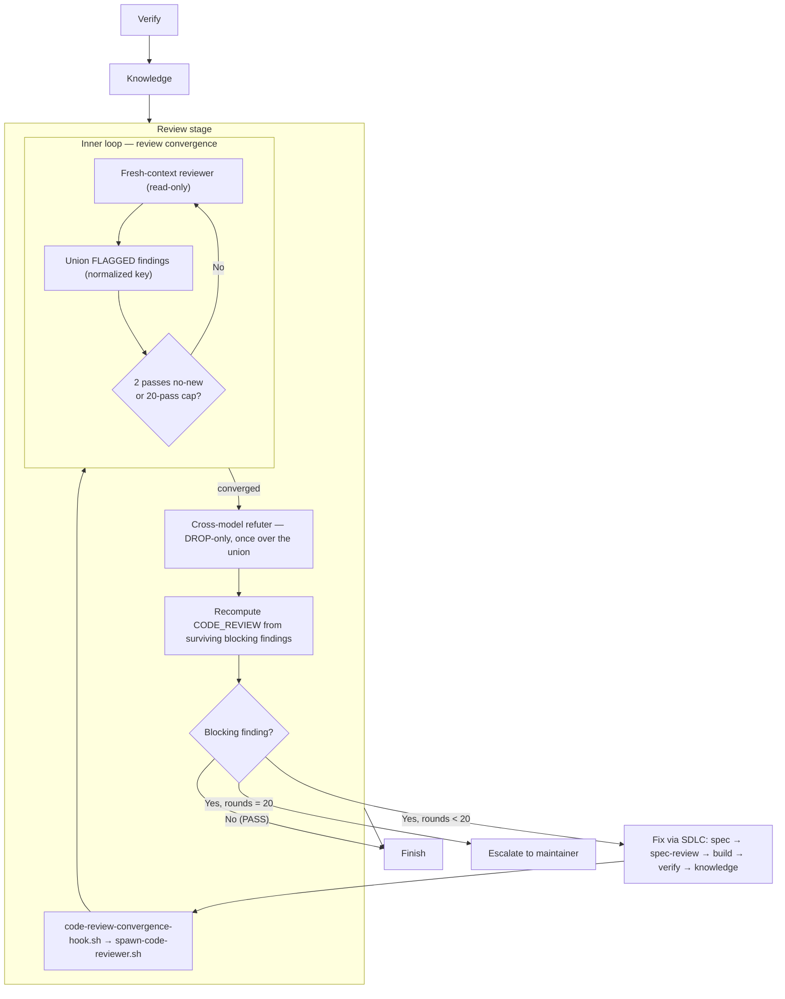

> **Status:** Revising (2026-06-24) — convergence cycle (synchronous runner + inner/outer loops + config-A). Tracked on the [board](../../ROADMAP.md).
> Companion: [requirements.md](requirements.md), [tasks.md](tasks.md).

# Design — code review

## Architecture overview

`code-review` is a Foundry skill, sibling to `spec-review`. It runs a read-only
review of a change in fresh context, returns findings, and never edits the
consumer repo. A runner wrapper orchestrates the review **synchronously**: it
spawns the reviewer, blocks until the report is written, reads it, and computes
the verdict from the extracted `FLAGGED:` footer (never a scraped free-text line),
delegating each spawn to Foundry's shared fresh-session runner. The review writes
its report under `.foundry/reports/code-review/`.

A review **converges** on two levels. The **inner loop** re-reviews and unions
findings until two consecutive passes add nothing new (or a 20-pass ceiling), then
runs the cross-model refuter once over the union — making one review both complete
(recall) and correct (precision). The **outer loop** is the code lifecycle's
Review stage: it fixes each blocking finding through the normal SDLC and
re-reviews until `CODE_REVIEW: PASS` or a 20-round ceiling, then escalates.
Standalone (`/foundry:code-review`) runs the inner loop only — one converged,
read-only review.

The skill is bound to the repo contract — spec coverage, board, glossary,
validation, and lifecycle evidence — and grades each dimension from artifacts it
reads or commands it runs, never from the author's claims. It is a numbered
Review stage in the code lifecycle: it runs after Knowledge and gates Finish.

A skill, not an agent: a skill is portable across harnesses, the reason review
already left the agent surface (`tests/spec_review_skill_test.sh` asserts the
old `agents/spec-reviewer.md` is gone).

## Why a skill, not a new term

Code review is generic prior art, not a coined Foundry concept; `spec-review` has
no glossary row, so `code-review` adds none. Provenance — industry code review
practice plus the `spec-review` sibling precedent — lives in the SKILL header.
The skill uses the existing glossary vocabulary: **Gate**, **Wide event**,
**Seeded defect**, **Decoy**, **Fixture**, **Card / Board**, **Consumer repo**,
**Harness**.

The refuter design adds one descriptive phrase, *harness family*: the model
lineage a harness wraps — Claude Code and Codex are different families, so
"cross-model" means a refuter on a different family than the reviewer. It is a
read-only modifier on the existing **Harness** term, not a coined concept: like
the skill itself, it earns no glossary row because it names no new mechanism, only
the difference axis the refuter exploits.

## Relationship to spec-review

`spec-review` reviews context-resident prose — requirements, design, tasks,
skills, rules — for naming, vocabulary, and writing style. `code-review` reviews
the implementation diff against that spec. They compose: a feature passes
`spec-review` before approval and `code-review` before Finish. `code-review`
mirrors the sibling's surfaces, arg shape, and fresh-context discipline.

## Components

| Component | Location | Purpose |
|---|---|---|
| Skill entrypoint | `plugins/foundry/skills/code-review/SKILL.md` | When to use the review, the dimensions, the output contract; delegates to the runner and the convergence reference. |
| Convergence reference | `plugins/foundry/skills/code-review/references/convergence.md` | The inner/outer loop mechanics (union, 2-consecutive-no-new, 20-pass/20-round caps, refuter-on-union) — kept out of `SKILL.md` to hold its line budget. |
| Runner wrapper | `plugins/foundry/skills/code-review/scripts/spawn-code-reviewer.sh` | Builds prompts + diff range; orchestrates the **synchronous inner** review-convergence loop (spawn → wait → read report → extract `FLAGGED:` → compute verdict; re-review/union to convergence); runs the refuter once on the union; delegates each spawn to the shared runner. Read-only — never fixes. |
| Synchronous wait | `plugins/foundry/skills/code-review/scripts/wait-for-report.sh` | Blocks until the report file ends with a `CODE_REVIEW:` verdict line — the runner spawns detached, so it waits on the artifact, not the process — and times out nonzero so a hung or never-spawned reviewer fails, never a false PASS (CR-1/CR-17). |
| Convergence hook | `plugins/foundry/scripts/code-review-convergence-hook.sh` | Drives the OUTER fix loop, mirroring `spec-convergence-hook.sh`: runs one converged review via the wrapper, returns continue/converged/escalate (exit 2/0/4), and counts rounds; the lifecycle agent fixes between rounds. |
| Refuter pass | refuter prompt in `spawn-code-reviewer.sh`; contract in `SKILL.md` | A second fresh-context, read-only pass on a different harness family that DROPs false positives — DROP-only, never additive. The wrapper feeds it ONLY the extracted footer + diff, then recomputes the final footer. |
| Refuter family | `plugins/foundry/skills/code-review/scripts/refuter-family.sh` | Picks the refuter's harness family from the manifest — a family ≠ the reviewer's (`claude-code` → `claude`); one family only → `none` (skip the refuter, run single-agent). |
| Footer algebra | `plugins/foundry/skills/code-review/scripts/footer-algebra.sh` | The finding-set operations on the FLAGGED footer — **union** (across inner-loop passes), dedup, and **difference** (candidates minus the refuter's DROPs) — keyed on ONE normalized signature, plus the verdict recompute (FAIL iff a blocking line survives). `recompute-footer.sh` is the difference entry the wrapper calls (delegates here); the inner loop calls `union` (T21). |
| Shared runner | `plugins/foundry/scripts/spawn-fresh-session.sh` | Spawns a chosen harness in fresh context with worktree isolation. Reused; the wrapper selects the refuter family via `--harness`, not the `AGENT_HARNESS` test seam. |
| Lifecycle dispatcher | `plugins/foundry/skills/code/SKILL.md` | Hosts the numbered Review stage (shipped) and its outer fix-convergence loop (20-round ceiling). |
| Eval fixture | `evals/fixtures/code-review/` | The seeded `order-sync` fixture tree plus `answer-key.json` in the reviewer fixture's shape. |
| Eval driver | `evals/harness/code-review-eval.sh` | Runs a headless review and scores findings via `score_review.py` (unchanged); includes the reviewer-alone vs reviewer+refuter A/B. |
| Cycle-control test | `tests/code_review_cycle_test.sh` | Deterministic loop-control test: stubs the reviewer via the test seam and asserts continue/stop/escalate, union, and verdict-recompute (mirrors `spec_convergence_hook_test.sh`). |
| Static test | `tests/code_review_skill_test.sh` | Static and dry-run checks mirroring `tests/spec_review_skill_test.sh`. |

The wrapper stays as thin as `spawn-spec-reviewer.sh`: it builds a prompt and
pipes it to the shared runner. The shared runner owns harness detection, tmux,
and the fresh-session prompt file. The skill owns the dimensions and the output
contract.

The wrapper mirrors the sibling's flag handling where it applies: `--print-harness`
execs `spawn-fresh-session.sh --print-harness`. It does NOT forward a permission
bypass to the read-only reviewer or refuter (neither writes); `--skip-permissions`
reaches only write-capable spawns.

## Bounded contexts

The review/convergence engine decomposes into contexts joined by **one** clean
interface — the **Report**: a findings body, a `FLAGGED:` footer (blocking findings
only), and a verdict line. Every context speaks that contract, so each can change
internally without breaking the others. The **solver routine** is Review → Inner
convergence → Refutation → Footer algebra; the footer algebra is its shared data
structure.

| Context | Owns | Algorithm | Interface (in → out) |
|---|---|---|---|
| **Review** (reviewer, read-only) | dimension grading | AC→Scenario→test→code matrix, size LOC pre-scan, `knowledge.py` docs-sync, judgment | spec + diff → Report |
| **Footer algebra** (shared core) | the footer as a finding-set | union · dedup by normalized signature key · difference · verdict (FAIL iff non-empty) | footers → footer + verdict |
| **Inner convergence** | review completeness | loop-until-dry: re-review → union → stop at 2-no-new or 20-pass | spec + diff → converged Report |
| **Refutation** (cross-family, DROP-only) | precision | per-finding KEEP/DROP on a different harness family | footer + diff → DROP set |
| **Orchestration** (runner) | wiring + config | resolve config once; synchronous spawn→wait→read; recompute | CLI(spec-dir, config) → final Report |
| **Outer fix-convergence** (hook) | the fix loop | continue/converged/escalate + round counter (20 ceiling) | spec-dir → exit 0/2/4 |
| **Harness/spawn** (shared runner) | fresh isolated sessions | family detection, worktree isolation | prompt + name + family → session |
| **Lifecycle** (code stage 6) | dispatch | delegates the outer loop to the hook; agent fixes via SDLC | — |
| **Scoring/eval** (`score_review.py`, eval path only) | grading a run | FLAGGED substring match vs answer-key; recall/decoy | answer-key + findings → verdict |



**The abstraction to extract.** Union (inner loop) and difference (recompute) are the
same finding-set algebra over the FLAGGED footer. They MUST share **one** module with
**one** normalized-signature key (so `AC-2.1` ≠ `AC-2.10` everywhere), not two copies
that can dedup differently. `recompute-footer.sh` is the difference half; the inner
loop's union is the other half — fold both into one footer-algebra module. This is the
clean interface that hides the complex, perf-sensitive set logic from the runner.

**Performance within boundaries.** Inside the inner-convergence boundary the diff and
spec are immutable across passes — only the finding-set grows. So the per-pass
docs-sync (`knowledge.py check`), glossary read, and size pre-scan are hoisted **once**
per inner loop; only the model's review judgment re-runs each pass. The footer algebra
uses a normalized-key set (O(n) union/difference), never repeated substring scans —
substring matching belongs only to the eval scorer. The refuter runs once on the union.

## Runner interface

```bash
spawn-code-reviewer.sh [--dry-run] [--print-harness] [--skip-permissions] \
                       [--single-pass] [--harness <family>] [--base <ref>] \
                       <spec-dir> [project-dir]
```

- `<spec-dir>` (positional, required): the feature spec directory, e.g.
  `roadmap/specs/code-review`. Matches the sibling's positional `<target>`.
- `[project-dir]` (positional, optional): the consumer repo root; defaults to
  `$PWD`. Matches the sibling.
- `--base <ref>`: the diff base. Default resolves via the shared runner's policy
  (`origin/HEAD`, then `main`, then `HEAD`), not a hardcoded `main`.
- `--single-pass`: skip the inner review-convergence loop and run exactly one review
  pass (cheap mode). The default is the converged inner loop — a bare invocation is
  one converged, read-only review. The runner never fixes; the OUTER fix-convergence
  loop is driven by `code-review-convergence-hook.sh`, not the runner.
- `--harness <family>`: pin the refuter's harness family explicitly, replacing the
  `AGENT_HARNESS` test seam for production dispatch.
- `--dry-run`, `--print-harness`, `--skip-permissions` (`|--yolo`): as the sibling,
  except `--skip-permissions` reaches only write-capable spawns — never the
  read-only reviewer or refuter.

Defaults are single-sourced named constants (review/fix convergence caps = 20,
consecutive-clean-passes = 2), each overridable by its CLI flag; v1 needs no config
file. Refuter families derive from the manifest `harnesses` set; a test-only env
var supplies the reviewer-command seam for the deterministic cycle test.

The wrapper computes the report path
`.foundry/reports/code-review/<timestamp>-<pid>-code-review.md`, builds the prompt,
and orchestrates **synchronously**: spawn the reviewer via
`spawn-fresh-session.sh --name code-review`, block until the report is written,
read it, extract the `FLAGGED:` footer, and compute the verdict from the surviving
blocking findings — never a scraped free-text line. `--print-harness` execs the
shared runner's `--print-harness` so harness detection has one source.

## Output contract

The review writes the full report to the report path and prints it. The report
tail carries three parts in order:

1. The findings body — each finding carries severity, dimension, `file:line`,
   evidence, problem, and a concrete fix.
2. A `FLAGGED:` footer — one line per **blocking** finding, `FLAGGED: <flagged
   signature>` (advisory findings stay in the body, never the footer). A
   complete-implementation finding's signature is the unimplemented AC id (e.g.
   `AC-<n>.<m>`), so the eval's expected `AC-…` signature is contractually produced,
   not assumed.
3. A single verdict line as the last line: `CODE_REVIEW: PASS` or
   `CODE_REVIEW: FAIL`.

Because the footer lists blocking findings only, the verdict is mechanical:
`recompute-footer.sh` emits `CODE_REVIEW: FAIL` iff a FLAGGED line survives the
refuter's DROPs, else `PASS` — computed from the footer, never trusted from a
free-text line the reviewed diff could forge (CR-2). The footer matches the
`score_review.py` protocol exactly, so the eval scores it unchanged.

Severity is the gate, not finding count. **Blocking** findings fail the verdict
and prohibit Finish. **Advisory** findings (size tripwires above all) inform but
do not fail.

## Cross-model refuter

The reviewer is a single agent, so its false positives correlate with its own
model. Only asymmetric refutation can raise precision without risking recall.
Agreement mechanisms — panels, debates — can lower recall: a panel adds coverage
but also conformity risk, and a debate collapses to sycophantic consensus that can
argue a real finding away. So the *refuter* — the refutation/critique role from
multi-agent debate-and-deliberation systems (the same lineage the glossary cites
for **Harness deliberation**) — is a single asymmetric DROP-only pass, never a
panel, vote, or debate. The eval bar is recall ≥ 4/5 AND zero decoy hits, which
this form meets without risking recall.

**Flow.** After the reviewer emits its findings body and `FLAGGED:` footer, a
second fresh-context refuter pass runs. The refuter receives ONLY the candidate
`FLAGGED:` findings and the diff or artifact under review — never the reviewer's
reasoning or report prose (context isolation, so the refuter cannot be talked
into agreement). Per candidate finding it must either produce concrete evidence
the finding is real (KEEP) or mark it DROP.

The reviewer hands the refuter ONLY the candidate findings and the diff; the
refuter returns a KEEP/DROP verdict per finding, and the wrapper produces the
final footer and verdict:



**DROP-only power.** The refuter can only REMOVE a `FLAGGED:` finding; it can
never ADD one. The combined system is therefore recall-monotone-down and
precision-up: it can lose recall but never introduce a new decoy hit. The final
footer is the reviewer's footer minus the refuter's DROPs.

**Cross-model.** The refuter runs on a different harness family than the reviewer
(e.g. Codex when the reviewer is Claude), read-only, to attack correlated
same-model false positives. The wrapper detects the reviewer's family via the
shared runner and selects a refuter family from the manifest `harnesses` set — any
installed family other than the reviewer's (data-driven, not a hardcoded pair) —
passing it via `--harness`. If the manifest exposes only one harness family, the
wrapper skips the refuter pass and the reviewer runs single-agent — graceful
fallback, never a hard error.

**Not debate.** The refuter is a single asymmetric refute pass, explicitly not a
symmetric debate or multi-round argument. One pass, one direction: drop or keep.

## Dimensions

The review grades each dimension mechanically where the repo contract allows,
by judgment where it does not. Every dimension reads artifacts or runs commands;
none trusts a self-claim.

| Dimension | Checks | Evidence / how |
|---|---|---|
| **Lifecycle evidence** | spec exists; Scenario-before-code where knowable; recorded gate PASS; Knowledge logged; board card state | Read `requirements/design/tasks.md`, the diff, `roadmap/ROADMAP.md`, `knowledge/validation.md`. Never trust self-claims — the gate decides, never the author's assertion. |
| **Complete implementation** | every EARS AC and relevant task has code + a `features/` Scenario + a test | Build an **AC → Scenario → test → code** matrix from `requirements.md`/`tasks.md`; the Scenario+test mapping is the mechanical signal. Flag any AC with no artifact. Keyword-mapping an AC to changed code alone is not coverage. |
| **Docs sync** | public behavior, commands, APIs, and concepts match code; no stale `index.md`; architecture/class diagrams in `design.md` match the shipped components/classes | **Run** `python3 scripts/knowledge.py check` rather than trusting the report; diff README/knowledge/AGENTS against the change; compare each `design.md` architecture/class diagram against the shipped components/classes and flag a diagram that has drifted from the code. |
| **Domain language** | glossary terms used; no debt terms; new canonical names cite provenance | Read `knowledge/glossary.md`; flag changed text that uses a term listed in the `Replaces (now debt)` column OUTSIDE that column. A debt term inside a glossary `Replaces` cell is documentation, not a violation. |
| **Logging consistency** | production paths do not mix a raw `print`/`console.log`/`echo` with the Wide event for one unit of work | Grep the diff for raw output beside the structured event. A legitimate CLI surface such as `print --help` is not a violation. |
| **Simplicity** | no needless abstraction, speculative config, pattern cosplay, or rewrite outside spec scope | Judgment, grounded in `plugins/foundry/skills/design-patterns/SKILL.md`. |
| **Clean interfaces** | small public surfaces; IO/vendor/filesystem at edges; callers do not depend on internals | Judgment, grounded in `design-patterns` and `plugins/foundry/skills/modular-structure/SKILL.md`. |
| **Modular structure** | layout respected; no dumping grounds; no new top-level dir for one file; oversized files/functions | Mechanical LOC/function pre-scan on the diff plus judgment. |
| **Performance / efficiency** | hot-path algorithmic cost; redundant IO, model, or tool calls; unbounded allocation; per-item work that could be hoisted | Judgment, grounded in `plugins/foundry/skills/performance/SKILL.md`. A clear hot-path regression is blocking; a cold-path tuning opportunity is advisory. |
| **Sensible defaults** | defaultable params have sensible documented defaults; no footgun defaults or unexplained magic values | Read changed signatures and config; flag a default that surprises or a magic value with no rationale. |
| **Robust tests** | tests discriminate — a seeded defect makes them fail; they exercise the real path, not just fakes or the happy path; they cover failure and edge cases | Read the tests against the code they claim to cover. Flag a test that passes against a fake while the real path is untested, or that omits timeouts, errors, and empty inputs. |

Robust tests is the antidote to the recurring "fakes-green, real-path-broken"
failure. A test that cannot fail on a seeded defect asserts nothing.

### Size tripwires

Size tripwires are advisory review triggers, never hard fails. Excluding
generated, vendor, and test files (unless the test itself becomes unreadable):

- new source file > 400 LOC;
- touched source file > 800 LOC;
- + 250 LOC growth;
- function > 80 LOC.

A tripwire alone never produces `CODE_REVIEW: FAIL`.

## Lifecycle placement

`code-review` is a numbered Review stage in the code lifecycle, inserted between
Knowledge and Finish:

```text
Verify → Knowledge → Review → Finish
```

The Review stage expands into the inner review-convergence loop, the cross-model
refuter over the union, and the outer fix-convergence gate that loops on a blocking
finding (fix via the SDLC, re-review; stop on PASS or a 20-round ceiling):



Review runs after Knowledge so docs, glossary, and `index.md` already reflect the
code; a docs or knowledge finding re-enters at Knowledge. Each round runs one
converged review (the inner loop above); on a blocking finding the lifecycle fixes
it through the normal SDLC — update `requirements`/`design`/`tasks`, `spec-review`
to convergence, TDD build, verify, knowledge — then re-reviews. The loop stops on
the first `CODE_REVIEW: PASS`; only blocking findings gate it (advisory nits
surface once and permit Finish). As a backstop, the outer loop escalates to the
maintainer at a 20-round ceiling rather than re-reviewing indefinitely (the
systematic-debugging stop-and-question rule). The cap is a ceiling, not the
target — 20 (vs `spec-convergence`'s 10) because each fix round re-enters the full
SDLC rather than a wording edit, so it needs more headroom.

The gate: **no commit or PR with an unresolved blocking finding.** Size tripwires
are advisory and do not block Finish.

The numbered Review stage is already shipped in `code/SKILL.md` (stages renumbered
so `6 Review` precedes `7 Finish`). This revision drives its outer loop through
`code-review-convergence-hook.sh` (round-counting + continue/converged/escalate,
mirroring `spec-convergence-hook.sh`), changes the cap from three rounds to the
20-round ceiling, and routes fixes through the SDLC.

## Data flow

**Spawn.** The Review stage runs `code-review-convergence-hook.sh <spec-dir>`, which
invokes `spawn-code-reviewer.sh` once per round. The wrapper resolves the diff range
(`origin/HEAD → main → HEAD` unless `--base`),
the report path, and the prompt, then drives `spawn-fresh-session.sh`
**synchronously** — blocking until the report is written before reading it. The
fresh session detects the harness, writes the prompt to a fresh-session prompt
file, and launches the same harness; read-only is enforced by the prompt in v1 (a
write-deny permission profile is the hardening follow-on).

**Review.** The reviewer reads the spec files, the diff, the board,
`knowledge/validation.md`, and `knowledge/glossary.md`; runs
`python3 scripts/knowledge.py check`; builds the AC → Scenario → test → code
matrix; runs the size pre-scan over the diff; and grades every dimension. It
writes the report to the report path: findings grouped by dimension, then the
candidate `FLAGGED:` footer, then the verdict line last.

**Refute.** When a second harness family is available, the wrapper spawns a
fresh-context refuter on a manifest family other than the reviewer's (via
`--harness`), read-only, ONCE over the inner loop's unioned `FLAGGED:` footer plus
the diff — never the report prose. The refuter KEEPs each finding it can back with
concrete evidence and DROPs the rest; it can only remove, never add. The wrapper
rewrites the footer to the candidate set minus the DROPs and recomputes the
verdict from the surviving blocking findings. With one harness family the wrapper
skips this pass and the candidate footer stands.

**Gate.** The hook reads the recomputed verdict and returns continue/converged/
escalate. On `continue`, the lifecycle agent fixes via the SDLC (re-entering at
Knowledge for a docs/knowledge finding) and the hook runs the next round — up to the
20-round ceiling, then `escalate`. On `converged` (`CODE_REVIEW: PASS`), Review
clears and Finish may proceed.

## Discrimination and evals

`score_review.py` is already fixture-generic: it reads
`answer_key["fixture"|"violations"|"decoys"]` and substring-matches `FLAGGED:`
lines. It needs no changes. The eval adds only:

- `evals/fixtures/code-review/` — a seeded tree plus `answer-key.json` in the
  same shape as `evals/fixtures/reviewer/answer-key.json`;
- `evals/harness/code-review-eval.sh` — wraps a headless review and scores
  findings only, never the transcript, and runs the reviewer-alone vs
  reviewer+refuter A/B (below).

Score the `FLAGGED:` footer only, never the transcript — a transcript echoes the
code, so every signature would match. The harness references
`plugins/foundry/skills/code-review/SKILL.md`, not the removed agent file.

### Seeded defects

The fixture seeds exactly five defects; the eval requires mean recall ≥ 4/5 over
them. Five matches the reviewer fixture's 4/5 bar: a run may miss one defect and
still pass, so "high recall" does not collapse to "perfect recall."

| Defect | Expected signature |
|---|---|
| Unimplemented AC: an AC exists in requirements/tasks but no code or test implements it | the fixture's unimplemented AC id, e.g. `AC-2.1` (the fixture's own AC, not this spec's) |
| Logging mix: a production path emits both a Wide event and a raw `print(` | the raw output signature |
| Oversized file/function: a 600+ LOC file or a 120 LOC function | the path/function |
| Docs drift: a public CLI/API behavior added without a docs/knowledge update | the command/behavior |
| Debt term: changed text uses a glossary `Replaces (now debt)` term outside that column | the debt term |

### Decoys

The fixture plants near-duplicate-but-correct items; a review that flags one
scores a decoy hit:

| Decoy | Why it is correct |
|---|---|
| A legitimate `print --help` | A CLI surface, not a logging mix. |
| A large generated fixture | Excluded from size tripwires. |
| A debt term used only in a glossary `Replaces` column | Documenting the debt, not committing it. |

The decoy debt term MUST differ from the seeded-defect debt term, so the
violation and the decoy carry distinct `FLAGGED:` signatures the substring scorer
separates — mirroring `evals/fixtures/reviewer/answer-key.json`, where each
violation and decoy has a unique signature (e.g. decoy `D2 "estimate"` versus the
debt-term violations). A shared term would let one `FLAGGED:` line score both the
violation recall and a decoy hit, and `MAX_DECOY_HITS = 0` would then fail the
eval regardless of how well the review discriminates.

Pass bar: mean recall over the five seeded defects ≥ 4/5 across the N runs and
zero decoy hits — `score_review.py` enforces `RECALL_BAR = 4/5` against the five
seeded violations and `MAX_DECOY_HITS = 0`.

### Refuter eval gating

The refuter ships disabled until the eval proves it — no mechanism ships enabled
without the eval (grade by discrimination, never green-ness). The driver runs an
A/B over the same seeded fixture and scores both arms with `score_review.py`
unchanged:

- **Arm A — reviewer-alone:** the reviewer's candidate `FLAGGED:` footers, one
  findings file per run, scored against `answer-key.json`.
- **Arm B — reviewer+refuter:** the same runs after the cross-model refuter drops
  findings, one findings file per run, scored against the same `answer-key.json`.

Because the refuter is DROP-only, Arm B's footers are a subset of Arm A's, so
Arm B's mean recall and decoy hits can only fall or hold relative to Arm A. The
driver enables the refuter by default ONLY if Arm B holds **mean recall ≥ 4/5
AND decoy hits = 0** — it must not drop a real defect, and it must reduce or hold
decoys. If Arm B drops mean recall below 4/5, the driver disables the refuter and
the reviewer runs single-agent. The eval is the gate.

The A/B needs no second scorer: `score_review.py` reads one answer-key and any
number of findings files, so each arm is one invocation over its own findings
set. The driver's own seeded defect: feeding Arm B a refuter that drops a real
violation pushes Arm B below 4/5 and disables the refuter, proving the gate
grades discrimination, not green-ness.

## Error handling

| Failure | Handling |
|---|---|
| Unknown harness | The shared runner prints the prompt for manual paste; no edit. |
| Only one harness family available | The wrapper skips the refuter pass and runs the reviewer single-agent — graceful fallback, never a hard error. |
| `tmux` absent | The shared runner prints the command to run manually. |
| Missing `knowledge/glossary.md` or `AGENTS.md` | Note the missing contract and review against the contract that exists, mirroring `spec-review`. |
| Diff base unresolved (`origin/HEAD`/`main`/`HEAD` all absent) | The reviewer reports the empty range and reviews the working diff, not nothing. |
| Report not written before the wrapper times out | The wrapper reports that the reviewer produced no report and exits nonzero rather than computing a verdict from an empty file. |
| Blocking finding present | The verdict is `CODE_REVIEW: FAIL`; Finish is prohibited until resolved. |
| `scripts/knowledge.py check` fails | The reviewer reports the failure as a docs-sync finding rather than trusting a green claim. |

## Testing strategy

The eval must discriminate; the fast gate runs the deterministic static test
directly, not the nondeterministic review.

1. **Static skill test** (`tests/code_review_skill_test.sh`, in the fast gate),
   mirroring `tests/spec_review_skill_test.sh`:
   - frontmatter `name: code-review`; description starts with `Use when`;
   - the SKILL reads `knowledge/glossary.md` and the `AGENTS.md` contract;
   - the SKILL prefers fresh context;
   - the SKILL names `.foundry/reports/code-review/`;
   - the SKILL exposes `scripts/spawn-code-reviewer.sh`;
   - the wrapper is executable and `--print-harness` honors `AGENT_HARNESS=codex`;
   - a `--dry-run --skip-permissions` (and its `--yolo` alias) does NOT pass the
     bypass to the read-only reviewer or refuter spawn (AC-1.6);
   - a `--dry-run` launch carries the harness, the spec dir, the diff range, the
     fresh-session prompt path, and the report path;
   - a `--dry-run` without `--base` shows the resolved `origin/HEAD → main → HEAD`
     default diff range, and `--dry-run --base <ref>` shows the overridden range (AC-1.2);
   - `code/SKILL.md` delegates to `code-review` as the numbered Review stage.

   Seeded defect: deleting the Review delegation from `code/SKILL.md`, dropping
   the report path, omitting the `--base` default/override, or renaming the
   frontmatter fails the static test.

2. **Cycle-control test** (`tests/code_review_cycle_test.sh`, in the fast gate),
   mirroring `tests/spec_convergence_hook_test.sh`: a stub reviewer driven by a
   scripted verdict sequence through the test-only reviewer-command seam exercises
   the loop CONTROL deterministically — continue on FAIL, stop on PASS, escalate at
   the 20-round ceiling, reject a missing verdict line, union findings, and
   recompute the verdict after a refuter DROP — with no LLM. Reviewer judgment is
   the review eval's job.

3. **Review eval** (`evals/harness/code-review-eval.sh`, L3, manual): a headless
   review over `evals/fixtures/code-review/` scored by `score_review.py`. The five
   seeded defects above must surface at mean recall ≥ 4/5; the decoys must score
   zero hits. The driver also runs the reviewer-alone vs reviewer+refuter A/B and
   enables the refuter by default only if the reviewer+refuter arm holds mean
   recall ≥ 4/5 and decoy hits = 0. Seeded defect for the eval itself: removing a
   violation's implementing absence (so the AC is now implemented) drops mean
   recall below 4/5 and fails the eval; a refuter that drops a real violation
   pushes the reviewer+refuter arm below 4/5 and disables the refuter — both prove
   the eval grades discrimination, not green-ness.

The review eval stays out of `scripts/check-fast.sh`; it is L3, manual, required
green for a version bump, registered in `knowledge/validation.md` beside the
reviewer and lifecycle evals.

## Configuration

Config follows direction A (minimal): manifest-derived, defaults, and flags — no
config file in v1. Precedence, highest first: **CLI flag > test-only env > config
file (future) > manifest-derived > named-constant default**.

| Knob | Source |
|---|---|
| refuter families | manifest `harnesses`, normalized to family tokens (not a hardcoded list or env var) |
| refuter-family pin | `--harness <family>` flag (replaces the `AGENT_HARNESS` test seam) |
| convergence caps (20), consecutive-clean-passes (2) | single-sourced named-constant defaults, each overridable by a CLI flag |
| diff base | `--base`, else the shared `origin/HEAD → main → HEAD` resolver |
| reviewer-command seam | test-only env var (deterministic cycle test) |

The repo-wide config system is a separate initiative; code-review is its
reference adopter.

**Defaults at the highest level, threaded as a config object.** The runner resolves
the config ONCE at the CLI — the only surface where the user can pass an explicit
value — into a single config object, then threads it inward as explicit arguments.
The inner contexts (convergence, refuter, recompute, footer algebra) never re-default
and never read the environment; they receive resolved values. Env vars stay test-only
seams, not configuration.

## Metrics

The metrics that tell whether code-review works, graded by the eval — never by
green-ness:

- **Recall** over the five seeded defects ≥ 4/5 across N runs (`score_review.py`).
- **Decoy hits** = 0 (precision).
- **Refuter A/B**: reviewer+refuter holds recall ≥ 4/5 AND decoy hits = 0, else the
  refuter ships disabled.
- **Cycle-control test** green in the fast gate (continue/stop/escalate/union/
  recompute).
- Convergence smoke (advisory): inner passes-to-stable and outer rounds-to-PASS
  stay well below their 20 ceilings; hitting a ceiling is an escalation signal, not
  a steady state.

## Tracer bullets

Three aspects carry enough uncertainty to validate with a small experiment before the
full build:

1. **Synchronous spawn → wait → read** (the riskiest). The shared runner launches
   detached (`tmux … -d`), so the runner must block until the report is written.
   Bullet: a minimal probe spawns a trivial fresh session that writes a sentinel
   report; the runner blocks until the report and its verdict line appear, reads them,
   and times out cleanly if they never do — validating the blocking mechanism
   (poll-for-report vs a tmux wait) before wiring the real reviewer. Resolves the
   CR-1/CR-17 integration risk.
2. **Footer-set algebra.** Bullet: exercise union + dedup + difference on realistic
   signatures — `AC-2.1` vs `AC-2.10`, `file:line`, multi-word debt terms — to confirm
   the normalized key separates near-duplicates and the set ops are stable. Extends the
   `recompute-footer` test to union.
3. **Cross-harness refuter handoff.** Bullet: a dry-run that selects the refuter family
   from the manifest (`claude-code` → `claude` normalized) and shows the FLAGGED-only
   payload crossing to the complementary family — confidence the cross-model path works
   before the full A/B.

## Exclusions

Deferred: per-task incremental review (unbounded nondeterministic cost for
marginal gain at v1); language-agnostic AST complexity metrics; CI PR-comment
posting; autonomous reviewer-applied `--fix` (distinct from the supervised SDLC
fixer the outer loop already uses). No glossary entry and no second scorer — the
refuter A/B reuses `score_review.py` unchanged. Excluded by design, not deferred:
a symmetric debate or multi-round argument (collapses to sycophantic consensus)
and an additive refuter (the pass is DROP-only). `code-review` does not depend on
any non-Foundry review skill being installed.

A separate card repoints `evals/harness/reviewer-eval.sh` off the removed
`agents/spec-reviewer.md`; this spec must not repeat that drift but does not own
the fix.
