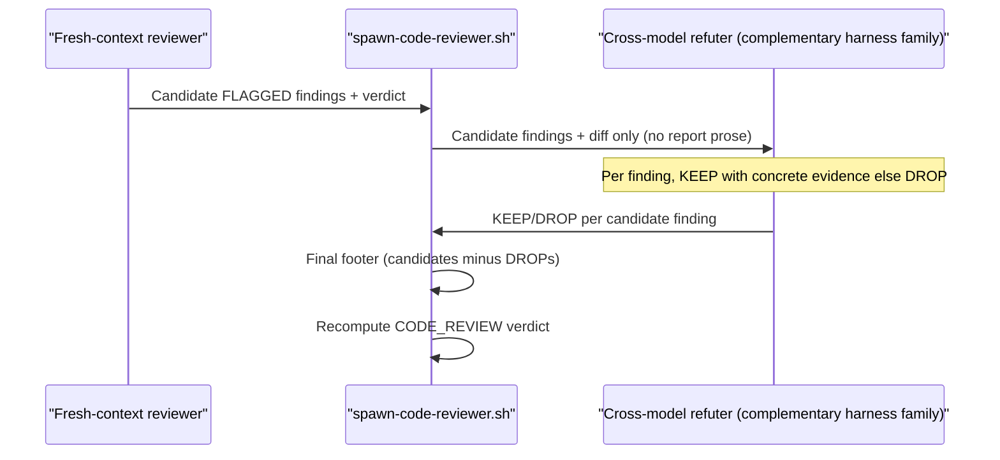
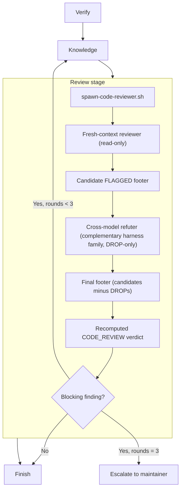

> **Status:** Ready (2026-06-20) — tracked on the [board](../../ROADMAP.md).
> Companion: [requirements.md](requirements.md), [tasks.md](tasks.md).

# Design — code review

## Architecture overview

`code-review` is a Foundry skill, sibling to `spec-review`. It runs a read-only
review of a change in fresh context, returns findings, and never edits the
consumer repo. A thin runner wrapper delegates to Foundry's shared fresh-session
runner; the review writes its report under `.foundry/reports/code-review/`.

The skill is bound to the repo contract — spec coverage, board, glossary,
validation, and lifecycle evidence — and grades each dimension from artifacts it
reads or commands it runs, never from the author's claims. It is a numbered
Review stage in the code lifecycle: it runs after Knowledge and gates Finish.

A skill, not an agent: a skill is portable across harnesses, the reason review
already left the agent surface (`tests/spec_review_skill_test.sh` asserts the
old `agents/spec-reviewer.md` is gone).

## Why a skill, not a new term

Code review is generic prior art, not a coined Foundry concept; `spec-review` has
no glossary row, so `code-review` adds none. Provenance — industry code review
practice plus the `spec-review` sibling precedent — lives in the SKILL header.
The skill uses the existing glossary vocabulary: **Gate**, **Wide event**,
**Seeded defect**, **Decoy**, **Fixture**, **Card / Board**, **Consumer repo**,
**Harness**.

The refuter design adds one descriptive phrase, *harness family*: the model
lineage a harness wraps — Claude Code and Codex are different families, so
"cross-model" means a refuter on a different family than the reviewer. It is a
read-only modifier on the existing **Harness** term, not a coined concept: like
the skill itself, it earns no glossary row because it names no new mechanism, only
the difference axis the refuter exploits.

## Relationship to spec-review

`spec-review` reviews context-resident prose — requirements, design, tasks,
skills, rules — for naming, vocabulary, and writing style. `code-review` reviews
the implementation diff against that spec. They compose: a feature passes
`spec-review` before approval and `code-review` before Finish. `code-review`
mirrors the sibling's surfaces, arg shape, and fresh-context discipline.

## Components

| Component | Location | Purpose |
|---|---|---|
| Skill entrypoint | `plugins/foundry/skills/code-review/SKILL.md` | Explains when to use the review, the dimensions, the output contract, and delegates to the runner. |
| Runner wrapper | `plugins/foundry/skills/code-review/scripts/spawn-code-reviewer.sh` | Builds the prompt, sets the diff range, runs the optional cross-model refuter pass, and delegates to the shared fresh-session runner. |
| Refuter pass | `plugins/foundry/skills/code-review/SKILL.md` (refuter prompt; the wrapper owns the cross-model spawn) | A second fresh-context, read-only pass on a different harness family that drops the reviewer's false positives — DROP-only, never additive. |
| Shared runner | `plugins/foundry/scripts/spawn-fresh-session.sh` | Spawns a chosen harness in fresh context. Reused unchanged; the wrapper pins the refuter's family via `AGENT_HARNESS`. |
| Lifecycle dispatcher | `plugins/foundry/skills/code/SKILL.md` | Gains a numbered Review stage between Knowledge and Finish. |
| Eval fixture | `evals/fixtures/code-review/` | A seeded tree plus `answer-key.json` in the reviewer fixture's shape. |
| Eval driver | `evals/harness/code-review-eval.sh` | Runs a headless review and scores findings via `score_review.py` (unchanged). |
| Static test | `tests/code_review_skill_test.sh` | Static and dry-run checks mirroring `tests/spec_review_skill_test.sh`. |

The wrapper stays as thin as `spawn-spec-reviewer.sh`: it builds a prompt and
pipes it to the shared runner. The shared runner owns harness detection, tmux,
and the fresh-session prompt file. The skill owns the dimensions and the output
contract.

The wrapper mirrors the sibling's exact flag handling, reusing rather than
re-coining: `--print-harness` execs `spawn-fresh-session.sh --print-harness`, and
`--skip-permissions` reuses the sibling's `--skip-permissions|--yolo` alias set —
no new permission flag vocabulary.

## Runner interface

```bash
spawn-code-reviewer.sh [--dry-run] [--print-harness] [--skip-permissions] \
                       [--base <ref>] <spec-dir> [project-dir]
```

- `<spec-dir>` (positional, required): the feature spec directory, e.g.
  `roadmap/specs/code-review`. Matches the sibling's positional `<target>`.
- `[project-dir]` (positional, optional): the consumer repo root; defaults to
  `$PWD`. Matches the sibling.
- `--base <ref>`: the diff base. Default `git merge-base main HEAD`. The only
  diff-range flag — no `--head`. This keeps the sibling's positional shape rather
  than introducing a new flag vocabulary.
- `--dry-run`, `--print-harness`, `--skip-permissions`: identical to the sibling,
  including the `--skip-permissions|--yolo` alias — reuse the sibling's handling,
  do not re-coin a permission flag.

The wrapper computes the report path
`.foundry/reports/code-review/<timestamp>-code-review.md`, builds a prompt that
names the spec dir, the diff range, the report path, and the SKILL, and pipes it
to `spawn-fresh-session.sh --name code-review`. `--print-harness` execs the
shared runner's `--print-harness` so harness detection has one source. Read-only:
the prompt forbids edits; the reviewer returns findings.

## Output contract

The review writes the full report to the report path and prints it. The report
tail carries three parts in order:

1. The findings body — each finding carries severity, dimension, `file:line`,
   evidence, problem, and a concrete fix.
2. A `FLAGGED:` footer — one line per flagged finding, `FLAGGED: <flagged signature>`.
   A complete-implementation finding's signature is the unimplemented AC id (e.g.
   `AC-<n>.<m>`), so the eval's expected `AC-…` signature is contractually produced,
   not assumed.
3. A single verdict line as the last line: `CODE_REVIEW: PASS` or
   `CODE_REVIEW: FAIL`.

`CODE_REVIEW: FAIL` whenever an unresolved blocking finding exists; `PASS` when
every finding is advisory or resolved. The footer matches the `score_review.py`
protocol exactly, so the eval scores it unchanged.

Severity is the gate, not finding count. **Blocking** findings fail the verdict
and prohibit Finish. **Advisory** findings (size tripwires above all) inform but
do not fail.

## Cross-model refuter

The reviewer is a single agent, so its false positives correlate with its own
model. Asymmetric refutation is the only form that can only raise precision.
Agreement mechanisms — panels, debates — can lower recall: a panel adds coverage
but also conformity risk, and a debate collapses to sycophantic consensus that can
argue a real finding away. So the *refuter* — the refutation/critique role from
multi-agent debate-and-deliberation systems (the same lineage the glossary cites
for **Harness deliberation**) — is a single asymmetric DROP-only pass, never a
panel, vote, or debate. The eval bar is recall ≥ 4/5 AND zero decoy hits, which
this form meets without risking recall.

**Flow.** After the reviewer emits its findings body and `FLAGGED:` footer, a
second fresh-context refuter pass runs. The refuter receives ONLY the candidate
`FLAGGED:` findings and the diff or artifact under review — never the reviewer's
reasoning or report prose (context isolation, so the refuter cannot be talked
into agreement). Per candidate finding it must either produce concrete evidence
the finding is real (KEEP) or mark it DROP.

The reviewer hands the refuter ONLY the candidate findings and the diff; the
refuter returns a KEEP/DROP verdict per finding, and the wrapper produces the
final footer and verdict:



**DROP-only power.** The refuter can only REMOVE a `FLAGGED:` finding; it can
never ADD one. The combined system is therefore recall-monotone-down and
precision-up: it can lose recall but never introduce a new decoy hit. The final
footer is the reviewer's footer minus the refuter's DROPs.

**Cross-model.** The refuter runs on a different harness family than the reviewer
(e.g. Codex when the reviewer is Claude), read-only, to attack correlated
same-model false positives. The wrapper detects the reviewer's family via the
shared runner, then pins the complementary family for the refuter through
`AGENT_HARNESS` and spawns it read-only. If the manifest exposes only one harness
family, the wrapper skips the refuter pass and the reviewer runs single-agent —
graceful fallback, never a hard error.

**Not debate.** The refuter is a single asymmetric refute pass, explicitly not a
symmetric debate or multi-round argument. One pass, one direction: drop or keep.

## Dimensions

The review grades each dimension mechanically where the repo contract allows,
by judgment where it does not. Every dimension reads artifacts or runs commands;
none trusts a self-claim.

| Dimension | Checks | Evidence / how |
|---|---|---|
| **Lifecycle evidence** | spec exists; Scenario-before-code where knowable; recorded gate PASS; Knowledge logged; board card state | Read `requirements/design/tasks.md`, the diff, `roadmap/ROADMAP.md`, `knowledge/validation.md`. Never trust self-claims — the gate decides, never the author's assertion. |
| **Complete implementation** | every EARS AC and relevant task has code + a `features/` Scenario + a test | Build an **AC → Scenario → test → code** matrix from `requirements.md`/`tasks.md`; the Scenario+test mapping is the mechanical signal. Flag any AC with no artifact. Keyword-mapping an AC to changed code alone is not coverage. |
| **Docs sync** | public behavior, commands, APIs, and concepts match code; no stale `index.md`; architecture/class diagrams in `design.md` match the shipped components/classes | **Run** `python3 scripts/knowledge.py check` rather than trusting the report; diff README/knowledge/AGENTS against the change; compare each `design.md` architecture/class diagram against the shipped components/classes and flag a diagram that has drifted from the code. |
| **Domain language** | glossary terms used; no debt terms; new canonical names cite provenance | Read `knowledge/glossary.md`; flag changed text that uses a term listed in the `Replaces (now debt)` column OUTSIDE that column. A debt term inside a glossary `Replaces` cell is documentation, not a violation. |
| **Logging consistency** | production paths do not mix a raw `print`/`console.log`/`echo` with the Wide event for one unit of work | Grep the diff for raw output beside the structured event. A legitimate CLI surface such as `print --help` is not a violation. |
| **Simplicity** | no needless abstraction, speculative config, pattern cosplay, or rewrite outside spec scope | Judgment, grounded in `plugins/foundry/skills/design-patterns/SKILL.md`. |
| **Clean interfaces** | small public surfaces; IO/vendor/filesystem at edges; callers do not depend on internals | Judgment, grounded in `design-patterns` and `plugins/foundry/skills/modular-structure/SKILL.md`. |
| **Modular structure** | layout respected; no dumping grounds; no new top-level dir for one file; oversized files/functions | Mechanical LOC/function pre-scan on the diff plus judgment. |
| **Performance / efficiency** | hot-path algorithmic cost; redundant IO, model, or tool calls; unbounded allocation; per-item work that could be hoisted | Judgment, grounded in `plugins/foundry/skills/performance/SKILL.md`. A clear hot-path regression is blocking; a cold-path tuning opportunity is advisory. |
| **Sensible defaults** | defaultable params have sensible documented defaults; no footgun defaults or unexplained magic values | Read changed signatures and config; flag a default that surprises or a magic value with no rationale. |
| **Robust tests** | tests discriminate — a seeded defect makes them fail; they exercise the real path, not just fakes or the happy path; they cover failure and edge cases | Read the tests against the code they claim to cover. Flag a test that passes against a fake while the real path is untested, or that omits timeouts, errors, and empty inputs. |

Robust tests is the antidote to the recurring "fakes-green, real-path-broken"
failure. A test that cannot fail on a seeded defect asserts nothing.

### Size tripwires

Size tripwires are advisory review triggers, never hard fails. Excluding
generated, vendor, and test files (unless the test itself becomes unreadable):

- new source file > 400 LOC;
- touched source file > 800 LOC;
- + 250 LOC growth;
- function > 80 LOC.

A tripwire alone never produces `CODE_REVIEW: FAIL`.

## Lifecycle placement

`code-review` is a numbered Review stage in the code lifecycle, inserted between
Knowledge and Finish:

```text
Verify → Knowledge → Review → Finish
```

The Review stage expands into the reviewer, the cross-model refuter, and the gate
that loops on a blocking finding (cap three rounds, then escalate):



Review runs after Knowledge so docs, glossary, and `index.md` already reflect the
code; a docs or knowledge finding loops back to Knowledge before re-review. The
stage spawns the review in fresh context, reads the report, fixes blocking
findings, and re-runs until none remain. The loop converges because only blocking
findings gate it — advisory nits are surfaced once and permit Finish, so a
nondeterministic reviewer cannot spin it forever. As a backstop, blocking findings
that persist after three rounds stop the loop and escalate to the maintainer
rather than re-reviewing indefinitely (the systematic-debugging stop-and-question
rule: persistent blocking findings signal a design problem, not a wording fix).

The gate: **no commit or PR with an unresolved blocking finding.** Size tripwires
are advisory and do not block Finish. `code/SKILL.md` gains the numbered Review
stage and its gate prohibition; Finish keeps its "branch first, ask before push"
rule after Review clears.

Concrete renumbering. `code/SKILL.md` numbers its stages 0–6 today, with
`- [ ] 6 Finish` last and matching body section headers (`## 5 · Knowledge`,
`## 6 · Finish`). Inserting Review pushes Finish to 7: the existing
`- [ ] 6 Finish` checklist line renumbers to `- [ ] 7 Finish`, a new
`- [ ] 6 Review` line lands before it, and the body headers stay consistent — add
a `## 6 · Review` section after `## 5 · Knowledge` and renumber `## 6 · Finish`
to `## 7 · Finish`. The Frame path "All stages 1 → 6" becomes "1 → 7".

## Data flow

**Spawn.** The Review stage runs `spawn-code-reviewer.sh <spec-dir>`. The wrapper
computes the diff range (`git merge-base main HEAD` unless `--base`), the report
path, and the prompt, then pipes the prompt to `spawn-fresh-session.sh`. The
fresh session detects the harness, writes the prompt to a fresh-session prompt
file, and launches the same harness read-only.

**Review.** The reviewer reads the spec files, the diff, the board,
`knowledge/validation.md`, and `knowledge/glossary.md`; runs
`python3 scripts/knowledge.py check`; builds the AC → Scenario → test → code
matrix; runs the size pre-scan over the diff; and grades every dimension. It
writes the report to the report path: findings grouped by dimension, then the
candidate `FLAGGED:` footer, then the verdict line last.

**Refute.** When the refuter is enabled and a second harness family is available,
the wrapper spawns a fresh-context refuter on the complementary family, read-only,
with ONLY the candidate `FLAGGED:` findings and the diff or artifact — not the
report prose. The refuter KEEPs each finding it can back with concrete evidence
and DROPs the rest; it can only remove, never add. The wrapper rewrites the
footer to the candidate set minus the DROPs and recomputes the verdict from the
surviving blocking findings. With one harness family the wrapper skips this pass
and the candidate footer stands.

**Gate.** The Review stage reads the report. Any blocking finding loops: fix,
return to Knowledge if the finding is docs/knowledge, re-spawn. When no blocking
finding remains, Review clears and Finish may proceed.

## Discrimination and evals

`score_review.py` is already fixture-generic: it reads
`answer_key["fixture"|"violations"|"decoys"]` and substring-matches `FLAGGED:`
lines. It needs no changes. The eval adds only:

- `evals/fixtures/code-review/` — a seeded tree plus `answer-key.json` in the
  same shape as `evals/fixtures/reviewer/answer-key.json`;
- `evals/harness/code-review-eval.sh` — wraps a headless review and scores
  findings only, never the transcript, and runs the reviewer-alone vs
  reviewer+refuter A/B (below).

Score the `FLAGGED:` footer only, never the transcript — a transcript echoes the
code, so every signature would match. The harness references
`plugins/foundry/skills/code-review/SKILL.md`, not the removed agent file.

### Seeded defects

The fixture seeds exactly five defects; the eval requires mean recall ≥ 4/5 over
them. Five matches the reviewer fixture's 4/5 bar: a run may miss one defect and
still pass, so "high recall" does not collapse to "perfect recall."

| Defect | Expected signature |
|---|---|
| Unimplemented AC: an AC exists in requirements/tasks but no code or test implements it | the fixture's unimplemented AC id, e.g. `AC-2.1` (the fixture's own AC, not this spec's) |
| Logging mix: a production path emits both a Wide event and a raw `print(` | the raw output signature |
| Oversized file/function: a 600+ LOC file or a 120 LOC function | the path/function |
| Docs drift: a public CLI/API behavior added without a docs/knowledge update | the command/behavior |
| Debt term: changed text uses a glossary `Replaces (now debt)` term outside that column | the debt term |

### Decoys

The fixture plants near-duplicate-but-correct items; a review that flags one
scores a decoy hit:

| Decoy | Why it is correct |
|---|---|
| A legitimate `print --help` | A CLI surface, not a logging mix. |
| A large generated fixture | Excluded from size tripwires. |
| A debt term used only in a glossary `Replaces` column | Documenting the debt, not committing it. |

The decoy debt term MUST differ from the seeded-defect debt term, so the
violation and the decoy carry distinct `FLAGGED:` signatures the substring scorer
separates — mirroring `evals/fixtures/reviewer/answer-key.json`, where each
violation and decoy has a unique signature (e.g. decoy `D2 "estimate"` versus the
debt-term violations). A shared term would let one `FLAGGED:` line score both the
violation recall and a decoy hit, and `MAX_DECOY_HITS = 0` would then fail the
eval regardless of how well the review discriminates.

Pass bar: mean recall over the five seeded defects ≥ 4/5 across the N runs and
zero decoy hits — `score_review.py` enforces `RECALL_BAR = 4/5` against the five
seeded violations and `MAX_DECOY_HITS = 0`.

### Refuter eval gating

The refuter ships disabled until the eval proves it — no mechanism ships enabled
without the eval (grade by discrimination, never green-ness). The driver runs an
A/B over the same seeded fixture and scores both arms with `score_review.py`
unchanged:

- **Arm A — reviewer-alone:** the reviewer's candidate `FLAGGED:` footers, one
  findings file per run, scored against `answer-key.json`.
- **Arm B — reviewer+refuter:** the same runs after the cross-model refuter drops
  findings, one findings file per run, scored against the same `answer-key.json`.

Because the refuter is DROP-only, Arm B's footers are a subset of Arm A's, so
Arm B's mean recall and decoy hits can only fall or hold relative to Arm A. The
driver enables the refuter by default ONLY if Arm B holds **mean recall ≥ 4/5
AND decoy hits = 0** — it must not drop a real defect, and it must reduce or hold
decoys. If Arm B drops mean recall below 4/5, the driver disables the refuter and
the reviewer runs single-agent. The eval is the gate.

The A/B needs no second scorer: `score_review.py` reads one answer-key and any
number of findings files, so each arm is one invocation over its own findings
set. The driver's own seeded defect: feeding Arm B a refuter that drops a real
violation pushes Arm B below 4/5 and disables the refuter, proving the gate
grades discrimination, not green-ness.

## Error handling

| Failure | Handling |
|---|---|
| Unknown harness | The shared runner prints the prompt for manual paste; no edit. |
| Only one harness family available | The wrapper skips the refuter pass and runs the reviewer single-agent — graceful fallback, never a hard error. |
| `tmux` absent | The shared runner prints the command to run manually. |
| Missing `knowledge/glossary.md` or `AGENTS.md` | Note the missing contract and review against the contract that exists, mirroring `spec-review`. |
| `git merge-base main HEAD` empty | The reviewer reports the empty range and reviews the working diff, not nothing. |
| Blocking finding present | The verdict is `CODE_REVIEW: FAIL`; Finish is prohibited until resolved. |
| `scripts/knowledge.py check` fails | The reviewer reports the failure as a docs-sync finding rather than trusting a green claim. |

## Testing strategy

The eval must discriminate; the fast gate runs the deterministic static test
directly, not the nondeterministic review.

1. **Static skill test** (`tests/code_review_skill_test.sh`, in the fast gate),
   mirroring `tests/spec_review_skill_test.sh`:
   - frontmatter `name: code-review`; description starts with `Use when`;
   - the SKILL reads `knowledge/glossary.md` and the `AGENTS.md` contract;
   - the SKILL prefers fresh context;
   - the SKILL names `.foundry/reports/code-review/`;
   - the SKILL exposes `scripts/spawn-code-reviewer.sh`;
   - the wrapper is executable and `--print-harness` honors `AGENT_HARNESS=codex`;
   - a `--dry-run --skip-permissions` (and its `--yolo` alias) launch passes the
     permission bypass through to the shared runner (AC-1.6);
   - a `--dry-run` launch carries the harness, the spec dir, the diff range, the
     fresh-session prompt path, and the report path;
   - a `--dry-run` without `--base` shows the `git merge-base main HEAD` default
     diff range, and `--dry-run --base <ref>` shows the overridden range (AC-1.2);
   - `code/SKILL.md` delegates to `code-review` as the numbered Review stage.

   Seeded defect: deleting the Review delegation from `code/SKILL.md`, dropping
   the report path, omitting the `--base` default/override, or renaming the
   frontmatter fails the static test.

2. **Review eval** (`evals/harness/code-review-eval.sh`, L3, manual): a headless
   review over `evals/fixtures/code-review/` scored by `score_review.py`. The five
   seeded defects above must surface at mean recall ≥ 4/5; the decoys must score
   zero hits. The driver also runs the reviewer-alone vs reviewer+refuter A/B and
   enables the refuter by default only if the reviewer+refuter arm holds mean
   recall ≥ 4/5 and decoy hits = 0. Seeded defect for the eval itself: removing a
   violation's implementing absence (so the AC is now implemented) drops mean
   recall below 4/5 and fails the eval; a refuter that drops a real violation
   pushes the reviewer+refuter arm below 4/5 and disables the refuter — both prove
   the eval grades discrimination, not green-ness.

The review eval stays out of `scripts/check-fast.sh`; it is L3, manual, required
green for a version bump, registered in `knowledge/validation.md` beside the
reviewer and lifecycle evals.

## Exclusions

Deferred: per-task incremental review (unbounded nondeterministic cost for
marginal gain at v1); language-agnostic AST complexity metrics; CI PR-comment
posting; `--fix` auto-application. No glossary entry and no second scorer — the
refuter A/B reuses `score_review.py` unchanged. Excluded by design, not deferred:
a symmetric debate or multi-round argument (collapses to sycophantic consensus)
and an additive refuter (the pass is DROP-only). `code-review` does not depend on
any non-Foundry review skill being installed.

A separate card repoints `evals/harness/reviewer-eval.sh` off the removed
`agents/spec-reviewer.md`; this spec must not repeat that drift but does not own
the fix.
