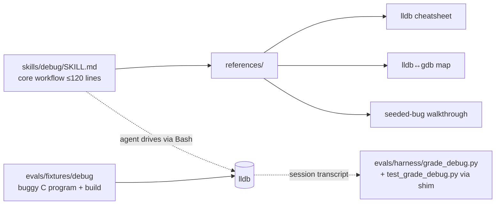

> **Status:** Planned (2026-06-28) — design pending approval; tracked on the [board](../../ROADMAP.md).
> Companion: [requirements.md](requirements.md), [tasks.md](tasks.md).

# Design — debug-skill

## Decisions

- **A skill, not a tool or wrapper script.** Debugging is judgment-heavy — *where* to break,
  *what* to inspect, *when* to step over vs. into. The skill teaches the workflow and the agent
  drives `lldb` through `Bash`, exactly as `code-review` is a skill that the agent enacts, not a
  script that runs it. No new tool or harness integration is needed.
- **`lldb` primary, `gdb` a documented sibling — one skill, not two.** The two debuggers share an
  identical workflow (breakpoint → run → step → inspect); only the command spelling differs. A
  single skill with an `lldb`↔`gdb` map in `references/` avoids duplicating a whole skill for a
  near-identical surface (rule-of-three: there is no third variant pulling for an abstraction).
  `lldb` leads because the dev platform is darwin (Clang/Swift default) and the eval runs there.
- **The eval proves *debugger use*, not just a right answer.** A live run (compiled binary +
  agent + `lldb`) graded on "breakpoint hit + frame/variable inspected + faulting line named." It
  ships gated/deferred like Foundry's other live evals (slow, costly), but the discrimination is
  designed now: a static-only run that guesses correctly still fails.
- **Naming / patterns / performance — N/A.** Standard debugger vocabulary (no coinage,
  `naming-standards` N/A); a self-contained skill with no boundary or extension point
  (`design-patterns` N/A); no hot path (`performance` N/A). `modular-structure` applies only as
  placement (below).

## Mechanism

| Surface | Change |
|---|---|
| `plugins/foundry/skills/debug/SKILL.md` | New skill: the core `lldb` workflow (launch/attach, breakpoints, step, inspect, exit) within budget; frontmatter `name`/`description`. |
| `plugins/foundry/skills/debug/references/` | `lldb` cheatsheet, `lldb`↔`gdb` command map, the seeded-bug walkthrough. |
| `evals/fixtures/debug/` | A tiny C program with a seeded defect + build command (fixture data only). |
| `evals/harness/grade_debug.py` | The grader: asserts debugger use + faulting-line localization from a transcript (the live run; gated/deferred). Lives in `evals/harness/` beside its test, per the `grade_*.py` precedent. |
| `evals/harness/test_grade_debug.py` + `tests/grade_debug_test.sh` | Gate-resident grader unit test: canned debugger-used transcript passes, static-guess fails. The `tests/grade_debug_test.sh` shim is what `check-fast`'s `tests/*_test.sh` glob discovers and runs, mirroring `tests/grade_navigation_test.sh`. |
| `knowledge/log.md` | Record the skill. |

## Metrics

Discrimination, not green-ness: the grader passes only when the transcript shows a breakpoint hit
**and** a frame/variable inspected **and** the faulting line named; a static-only run that guesses
the line fails — proven deterministically in `check-fast` by `test_grade_debug.py` against canned
transcripts (the live LLM run is deferred). Build + a single debugger session — perf N/A.

## Out of scope

- A separate `gdb` skill (covered by the sibling map).
- Remote/kernel/JIT debugging, reverse debugging, core-dump triage automation.
- Language-runtime debuggers (pdb, delve, jdb) — a possible future sibling, not this skill.
