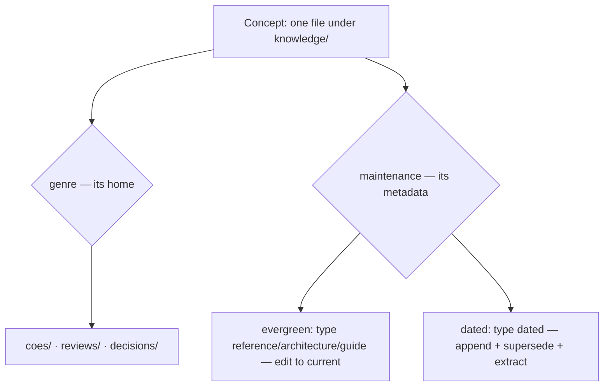

# Decision taxonomy — design

**Status:** Spec — design approved (2026-06-29): Option C (genre-by-directory), `type` set
`reference | architecture | guide | dated`, `decision` retired to the `decisions/` folder — tracked
on the [board](../../ROADMAP.md).

## Two axes, one field

The defect is that one frontmatter field — `type` — carries two independent classifications:

- **Maintenance axis** — *evergreen* vs *dated*. Governs the lifecycle discipline: edit-to-current
  vs append-and-supersede. This axis is currently implicit (a hardcoded `== "decision"` special-case
  in `knowledge.py`) and undocumented.
- **Genre** — within the dated class: COE, review, decision (ADR), investigation. Governs a record's
  *shape* and disambiguates the catch-all. Currently absent — all collapse into `decision`.

These are orthogonal: a literature survey is genre *review*, yet maintenance *evergreen*; a COE is
genre *coe* and maintenance *dated*. The redesign separates them. The three options differ in **how
genre is carried** and **what expresses the maintenance axis**.

## Option C — genre-by-directory + metadata facets (recommended)

The structure adopted and shipped in the octant repo (PR #15) after rejecting both A and B —
**one facet per folder, metadata for the rest**: the *folder* encodes genre, *frontmatter* (`type`,
`provenance`, `lifecycle`) carries the orthogonal facets. Folders cut the genre axis because `type`
already drives the sidebar.

- **Genre = directory**, three of them: `coes/` (corrections of error), `reviews/` (analyses — both
  literature surveys and system audits), `decisions/` (reserved for numbered ADRs, `0001-*.md`).
- **Maintenance axis = `type`**: `reference`/`architecture`/`guide` stay the evergreen genres; the
  dated class is typed **`dated`**. The closed `type` set becomes `reference | architecture | guide |
  dated`, made machine-readable by a `"dated_types": ["dated"]` config partition.
- **`decision` is retired as a type** — it survives only as the `decisions/` directory (the ADR
  genre). A COE is `type: dated` in `coes/`, never mislabeled a decision; an ADR is `type: dated` in
  `decisions/`.
- **`reviews/` is mixed by design:** a living literature survey is `type: reference` (evergreen); a
  point-in-time audit is `type: dated`. The folder names the genre, `type` names the maintenance
  class — the two axes never cross.
- **No new frontmatter field, no umbrella type.** `records/` was considered and rejected — it collides
  with code (`TraceRecord`, `DecisionRecord`) and is too generic.
- **Validation:** a `type: dated` concept SHALL live under a genre directory; `check` fails one that
  does not (AC-2.2).
- **Listing/index:** a section per genre directory, free — no sub-grouping code.

## Option A — `record` umbrella + genre field (alternative)

One dated `type` (`record`) replaces `decision`; a `genre` frontmatter field disambiguates.

- `type` set: `reference | architecture | guide | record` (four). New required field
  `genre: coe | review | decision | investigation`. Config: `"dated_types": ["record"]`.
- Keeps the flat `knowledge/` layout; pays with a second field + a lint rule keyed on it, and an
  umbrella name (`record`) that overloads a common noun.

## Option B — first-class genre types (alternative)

Each genre becomes its own `type`; `decision` narrows to ADR.

- `type` set: `reference | architecture | guide | coe | review | decision | investigation` (seven).
  Genre *is* the type; no new field. Config: `"dated_types": ["coe","review","decision","investigation"]`.
- Free per-type sections; pays by expanding the closed `type` set and making every future genre a
  convention break.

## Comparison

| Dimension | C — genre-by-directory | A — umbrella + field | B — first-class types |
|---|---|---|---|
| Genre carrier | the directory | a `genre` frontmatter field | the `type` |
| Closed `type` set size | 4 (`decision`→`dated`) | 4 | 7 |
| New frontmatter field | none (reuses `type`/`provenance`/`lifecycle`) | `genre` | none |
| Multi-facet concepts (survey = review + evergreen) | native — folder=genre, `type`=maintenance | native (field + type) | conflict — one `type` can't be both |
| Per-genre index sections | free (per directory) | sub-grouping code | free (per type) |
| Adding a future genre | a new directory | a new `genre` value | a new `type` (convention break) |
| `site_url` / layout cost | directories complicate URL mapping | flat, no cost | flat, no cost |
| `decision` misnomer fixed | yes — retired as a type (→ `decisions/` ADR folder); dated records typed `dated` | yes (`decision`→genre value) | yes (`decision`→ADR type) |
| Dogfooding evidence | shipped in octant (PR #15) | none | none |

## Recommendation

**Option C.** It is the structure the maintainer already reached and shipped downstream, after
explicitly rejecting A and B; foundry's mechanism should match what its own consumer repo does.
Rationale:

1. **Folders carry the one facet metadata can't double — genre; metadata carries the rest.** A
   concept has several facets at once (a survey is genre *review*, `type` *reference*, `provenance`
   *synthesized*). A single `type` (B) cannot hold both genre and maintenance; a `genre` field (A)
   works but adds a field where the filesystem already gives a free, self-documenting home.
2. **No new vocabulary to coin.** C reuses `type`, `provenance`, `lifecycle` and adds three plain
   directory names. A must coin and defend a `record` umbrella (an overloaded common noun); B must
   grow the closed `type` set.
3. **The maintenance axis stays explicit but cheap.** A one-line `"dated_types"` config partition
   makes evergreen-vs-dated machine-readable without a new field — satisfying the critique that the
   axis must be explicit, while keeping `type` the load-bearing maintenance marker.

C's cost is real and bounded: directories complicate `site_url` mapping (the index/sidebar generators
must map `knowledge/coes/x.md` → a URL), and a dated concept's genre is now positional (its folder),
so the lint keys on path, not a field. Both are local to `knowledge.py`.

**Resolved (maintainer, 2026-06-29):** `decision` is retired as a `type` and reserved for the
`decisions/` ADR folder; the dated maintenance class is typed **`dated`**, so a COE is `type: dated`,
never a "decision." This is the one place foundry improves on octant, which (as a consumer that could
not change the `type` set) reused `type: decision` as the dated marker. The only residual is the exact
word: `dated` ships unless `naming-standards` prefers an alternative — `record` overloads a common
noun, `log` collides with the reserved `log.md`.

## Vocabulary and provenance

Option C coins no new frontmatter field or type; it adds directory names and makes two existing
informal terms canonical. To add to `knowledge/glossary.md` at build time (search-prior-art rule):

| Term | Definition | Prior art | Replaces (now debt) |
|---|---|---|---|
| **Evergreen** (concept class) | A concept that must track current reality; drift from the code is a defect; edited to current. | Evergreen-content / living-document vocabulary. | — |
| **Dated** (concept class) | A point-in-time record; later code changes make it historical, not wrong; appended and superseded, never edited to current. | Point-in-time record / append-only-log vocabulary. | — |
| **Genre** (the directory axis) | A dated record's genre — its `coes/` \| `reviews/` \| `decisions/` home — distinguishing a correction, an analysis, and an ADR. | Information-architecture "one facet per folder" (categories-and-tags hybrid). | the `decision` catch-all |

The existing **Type** glossary entry changes: the closed set becomes `reference | architecture |
guide | dated`; `type` now marks the *maintenance class* (the evergreen genres vs the `dated` class),
not genre; and `decision` is removed as a type value — it names the `decisions/` folder instead. The
entry, the `okf.md` "Differences from OKF" table, and every `type: decision` record are updated in
lockstep (AC-4.3) so the old "`type` = genre / `decision` = the dated bucket" reading is recorded as
debt. Options A and B, had they been chosen, would coin a `record` type or expand the `type` set; they
remain documented above as the alternatives the maintainer rejected.

## Lifecycle semantics

The `lifecycle` field (`current | superseded | historical`) already exists; its surfacing in output
is delivered by the sibling card `okf-listing-fidelity` — a dependency that lands first (AC-3.2), not
work this spec repeats. This spec binds the field's *meaning* to the dated class, per the octant rule
**append + supersede + extract — not edit, not delete**:

- **Evergreen**: `lifecycle` is always `current` — the file is the live truth.
- **Dated**: a correction never rewrites the record. **Append** a new dated record; **supersede** the
  prior by marking it `lifecycle: superseded` (or `historical` when overtaken with no direct
  successor); and **extract** the durable lesson into the evergreen surface (glossary, conventions, or
  a validation gate) while the dated record remains as provenance. The `knowledge` skill's coherence
  pass flags an edited-to-current dated record (AC-3.3).

## Metrics

Primary signal is **discrimination**, not a numeric trend: the new `check` rule must fail on a dated
record that resolves to no genre and pass once it is filed under one (AC-5.1) — the seeded-defect
test. A secondary readable signal: foundry's own `knowledge.py list` shows the two former COEs under
`coes/`, no longer under a bucket misnamed `decision`. No latency/throughput metric applies — **N/A**
(a dev-tooling format change, not a runtime path).

## Open questions

1. **The exact dated-type word.** `dated` ships unless `naming-standards` finds better (`record`
   overloads a common noun; `log` collides with `log.md`). Low-stakes — a one-token rename.
2. **A fourth genre for investigations/experiments?** Octant folded surveys into `reviews/` and kept
   three directories; an investigation/experiment maps to `reviews/` (an analysis) unless a fourth
   `investigations/` earns its own home. Defer to `naming-standards`.
3. **`reviews/` vs `code-review` output.** A subsystem review/audit concept is distinct from a
   `code-review` run; confirm the glossary keeps them separate.
4. **`site_url` mapping for genre directories.** `build_index`/`build_sidebar`/`site_url` must map
   `knowledge/<genre>/x.md` to a clean URL and section without colliding with the crate-sync path
   logic already in `site_url`.
