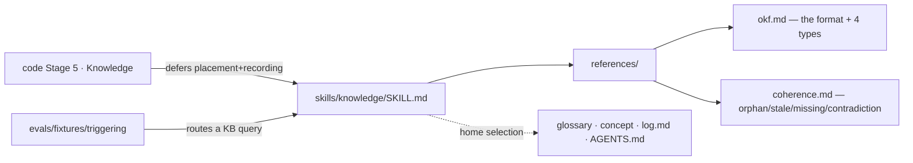

> **Status:** Done (2026-06-28) — built, `check-fast: PASS`, `CODE_REVIEW: PASS`; tracked on the [board](../../ROADMAP.md).
> Companion: [requirements.md](requirements.md), [tasks.md](tasks.md).

# Design — knowledge-skill

## Decisions

- **A guidance skill the lifecycle defers to — not more prose in Stage 5.** Mirrors
  `naming-standards`: `SKILL.md` carries the judgment, `code` Stage 5 stays a thin gate that
  *names* the skill. The mechanism (`knowledge.py check`/`index`, append to `log.md`) already
  lives in Stage 5; this adds the *where and why*, the part the mechanism can't decide.
- **Grounded in OKF + Karpathy, tightened for a single-repo engineering KB.** The base is a
  Google **Open Knowledge Format** bundle (one concept per file, `type` frontmatter, `index.md`
  for progressive disclosure, append-only `log.md`, links as an untyped graph). Karpathy's
  **LLM-Wiki** supplies the maintenance loop — *"the tedious part is the bookkeeping"*:
  update-don't-duplicate, append a History rather than silently rewrite, citation-anchor claims
  to sources, and lint for orphans / stale claims / missing pages / contradictions. Foundry is
  deliberately **stricter than OKF's permissiveness**: `knowledge.py` lints frontmatter, the
  glossary is a hard contract, and `check-skill-references` forbids orphans — the skill encodes
  that, not OKF's "tolerate anything." `references/okf.md` records the concrete divergences,
  grounded in `knowledge-config.json` — a fixed four-`type` set, required `title`/`description`,
  a strict lint, append-only `log.md`, and a **`lifecycle` field (current/superseded/historical)**
  for staleness that OKF has no equivalent for (Foundry's answer to Karpathy's stale-claim risk).
- **Progressive disclosure end to end.** The skill is structured for it — a lean `SKILL.md` →
  `references/okf.md` + `coherence.md`, loaded on demand — and it *teaches* it: the base's read
  path is `index.md` (catalog) → `knowledge.py outline <concept>` → `section <concept> <heading>`,
  so a reader takes a slice, never the whole file (the navigation-eval lesson). The maintainer
  keeps `index.md` current and writes a tight one-line `description` + clear headings, so the
  catalog and slice-navigation work — bad metadata breaks disclosure for every later reader.
- **The coherence lint is skill-guided judgment now; the mechanical subset already exists.**
  Frontmatter is gated by `knowledge.py check`; skill-reference orphans by
  `check-skill-references.sh`. Contradiction / stale-claim / missing-page detection is
  LLM-judgment (Karpathy's scoped contradiction: only between claims about the *same* concept) —
  the skill guides it. A future deterministic knowledge-lint is possible (the gate-not-prose
  principle) but is a follow-up, not this skill.
- **Naming / patterns / performance — N/A.** No coined term (operationalizes OKF + existing
  vocabulary; `naming-standards` N/A-new). A self-contained guidance skill, no boundary or
  extension point (`design-patterns` N/A). No hot path (`performance` N/A). `modular-structure`
  applies only as placement (below).

## Mechanism

| Surface | Change |
|---|---|
| `plugins/foundry/skills/knowledge/SKILL.md` | New guidance skill: home selection, the four OKF types, provenance + anchoring, append-don't-overwrite, coherence, and the run-the-mechanism mechanics. |
| `plugins/foundry/skills/knowledge/references/` | `okf.md` (the OKF format + type taxonomy) and `coherence.md` (the Karpathy lint checks). |
| `plugins/foundry/skills/code/SKILL.md` | Stage 5 names the `knowledge` skill (one line), as Stage 1 names `naming-standards`. |
| `evals/fixtures/triggering/cases.json` | Add `knowledge` to `expect_values` + a positive case and a near-miss; close the pre-existing `debug` gap with `debug` + a positive case (a label alone is untested — the grader scores only `cases`); refresh the stale `note` skill count. |

## Metrics

Discrimination, not green-ness: `grade_triggering.py` scores the new cases — a KB-maintenance
query routes to `knowledge`, a near-miss does not. Budget + reference reachability are gated by
the existing `check-context-budget.sh` / `check-skill-references.sh`. A guidance skill is loaded
context, not a hot path — perf N/A.

## Out of scope

- A deterministic knowledge-lint (orphans / stale / contradictions as a gate) — a follow-up;
  contradiction and staleness detection is judgment-heavy.
- The "raw sources" layer of Karpathy's wiki — Foundry's sources are the code and specs, not
  ingested papers.
- Restructuring the existing knowledge base — the skill governs *new* and *changed* concepts.
