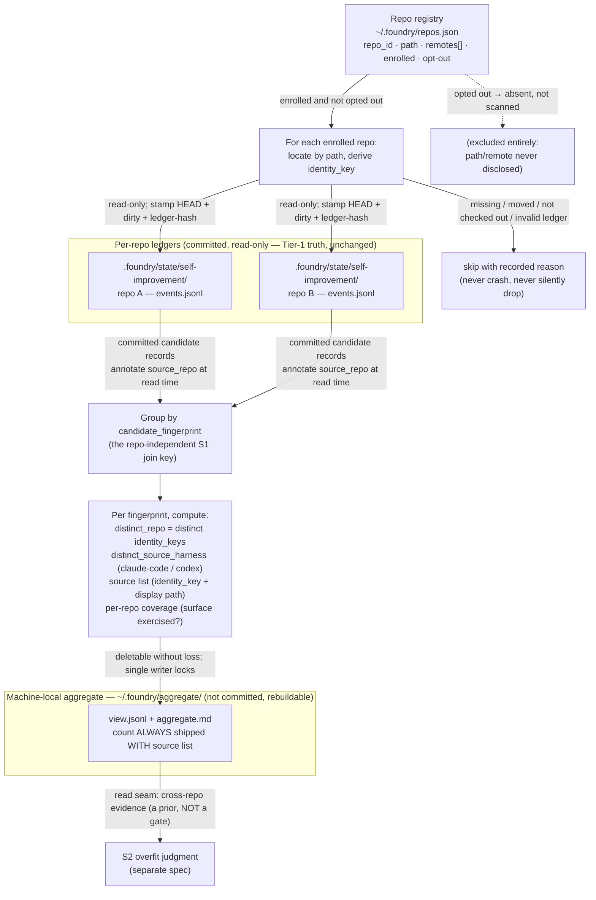

> **Status:** Ready (2026-06-21) — tracked on the [board](../../ROADMAP.md).
> Companion: [requirements.md](requirements.md), [tasks.md](tasks.md).

# Design — local multi-repo aggregate

## Architecture overview

One developer runs Foundry across many repos on one machine. A capability gap that
recurs in several of those repos is stronger evidence of a real Foundry problem than
one that shows up in a single repo. This spec adds a machine-local, read-only view
that joins each repo's committed S1 candidate ledger on the repo-independent
`candidate_fingerprint`, so the developer — when improving Foundry — sees "this cause
recurred across N of my repos." The count is **evidence feeding S2, never an
auto-gate** (§Evidence, not a gate).

The model is two levels, and the lower level is untouched:

| Level | Location | Tier | This spec |
|---|---|---|---|
| **Per-repo ledger** (S1) | `.foundry/state/self-improvement/` in each repo (committed) | Tier-1 truth | Reads it, read-only. Changes no S1 schema. |
| **Machine-local aggregate** | `~/.foundry/aggregate/` (not committed, gitignore-free because it lives outside any repo) | Tier-3 rebuildable view | This spec writes it. Deletable without loss. |

Three invariants, settled in the mediated `local-multirepo` deliberation, fix the
design:

- **Pull-only, view-only.** The aggregate is a pure function of `{registry snapshot,
  each ledger-at-read-time}` and is **deletable without loss** — delete
  `~/.foundry/aggregate/` and rebuild from the same inputs, byte-identical. If a
  delete ever loses information, the aggregate has become shadow truth, not a view.
  This is the broker's Tier-1-truth / Tier-3-rebuildable-view precedent, and the
  test is the broker `rebuild` determinism check (§Rebuildable view). No push hook,
  no daemon, no watcher, no cross-repo write.
- **`distinct_repo` is a prior, never a gate.** Cross-repo recurrence is correlated,
  not independent, evidence — clones overcount, forks carry different origin URLs
  but share a parent, one developer's repos share a domain, and a Claude/Codex
  regression manifests identically across every repo. Identity dedup fixes only
  clones; the other three are absorbed by surfacing the **source list** alongside
  the count so a human (or S2) can discount a fork or a domain cluster. The count
  never ships bare.
- **Per-repo S1 schema unchanged.** `source_repo` is a read-time annotation the
  aggregator adds from the registry, never a field the per-repo ledger emits. This
  works because the S1 `candidate_fingerprint` is repo-independent by construction
  (it excludes paths, repo names, and local ids — AC-6.1 of `loop-signal-store`),
  which is exactly what makes a no-schema-change pull-join possible.

The aggregator is the deterministic step the spike validated. The prototype
`.foundry/tmp/loop-dryrun/aggregate.py` is the reference implementation: once the
fingerprint is canonical, the join is pure code — group by fingerprint, count
distinct repos, carry the source list, render. This spec hardens that prototype with
robust repo identity, scan provenance, skip-with-reason error handling, and the
rebuild determinism check (§Rebuildable view).

## Components

| Component | Location | Purpose |
|---|---|---|
| Repo registry | `~/.foundry/repos.json` (XDG-respecting if `XDG_DATA_HOME` set; never committed) | The machine-local enrollment list: per repo, a minted stable local `repo_id`, the `path`, the observed `remotes[]`, an `enrolled` flag, and a machine-local opt-out. The single source the aggregator reads to know which repos to scan — no ambient filesystem discovery. Written by the bootstrap/update enrollment hook (§Enrollment). |
| Pull aggregator | `plugins/foundry/scripts/loop-multirepo-aggregate.py` | The read-only pull CLI. Scans the registry, reads each enrolled repo's committed S1 ledger read-only, groups by `candidate_fingerprint`, computes `distinct_repo` / `distinct_source_harness` / source list / coverage, stamps scan metadata, and renders the cross-repo view. Hardens the spike prototype `.foundry/tmp/loop-dryrun/aggregate.py`. The aggregate's own single writer — the only thing that locks. |
| Cross-repo view | `~/.foundry/aggregate/` (`view.jsonl` + rebuildable `aggregate.md`) | The rendered output: one record per fingerprint carrying `distinct_repo`, `distinct_source_harness`, the source list (identity keys + display paths), per-repo coverage, and per-repo scan metadata. The read seam S2 consults for cross-repo evidence. Tier-3 rebuildable; deletable without loss. |
| Enrollment hook | inside the bootstrap and update skills | On bootstrap/update, default-on: upsert the repo into `~/.foundry/repos.json`, refreshing `path` and `remotes[]`, preserving an existing opt-out (§Enrollment). The boundary-crossing consent rule lives here. |
| Aggregator test | `tests/loop_multirepo_aggregate_test.sh` | Drives the aggregator against fixture repos with seeded ledgers; carries the discriminating arms in §Testing strategy. |

## Data flow

The aggregator runs on demand. It reads the registry, reads each enrolled repo's
committed ledger read-only, joins on the fingerprint, and renders the view. It writes
nothing to any per-repo repo and holds no cross-repo lock — reads are lock-free
because the S1 ledger is append-only JSONL, so a torn trailing line is detected and
skipped (AC-2.6). Only the aggregate's own writer locks.

`source_repo` is annotated at the join step (AC-2.7): the aggregator stamps it from
the registry onto each in-memory observation it reads. It is never written back to
the per-repo ledger and is never a field S1 emits.

## Data models

### Registry record — `~/.foundry/repos.json`

One record per known repo. Identity is **hybrid**, doing two jobs (§Repo identity):
`repo_id` + `path` locate the repo and survive a move; the read-time `identity_key`
dedups clones for counting.

| Field | Purpose |
|---|---|
| `repo_id` | A minted stable local id (e.g. a UUID), assigned once at first enrollment. Survives a move; the dedup fallback when a repo has no origin remote. Never a path. |
| `path` | Absolute path to locate the repo now. Refreshed on each bootstrap/update so a move re-homes the repo without changing `repo_id`. |
| `remotes[]` | The observed remotes (name + URL) at enrollment, refreshed on update. The origin URL feeds `identity_key`; the list keeps forks and multiple remotes visible. |
| `enrolled` | Default-on for a bootstrapped/updated repo (AC-1.2). The local trust boundary. |
| `opted_out` | Machine-local opt-out (US-5). Lives **only** here, never in the repo. Its presence excludes the repo entirely; **opt-out is absent-from-the-aggregate, not flagged** (no presence/disclosure leakage). Preserved across `update` (AC-5.4). |

### Aggregate view record — `~/.foundry/aggregate/view.jsonl`

One record per `candidate_fingerprint`. The **count never ships without its source
list** (AC-3.2).

| Field | Purpose |
|---|---|
| `candidate_fingerprint` | The S1 join key — the repo-independent `(affected_surface, failure_mode)` hash. Identical bytes across repos for the same normalized cause. |
| `distinct_repo` | Count of distinct `identity_key`s contributing this fingerprint (AC-3.1). **Evidence, never a gate.** |
| `distinct_source_harness` | Distinct `source_harness`es contributing (claude-code, codex), with the per-harness breakdown (AC-3.5). A gap on both harnesses is stronger generic evidence than one concentrated on a single harness's adapter. |
| `source_list[]` | The distinct identity keys with display paths/remotes (AC-3.2, AC-4.3). What lets a human discount a fork, clone, or domain cluster. The count is meaningless without it. |
| `coverage[]` | Per enrolled repo: whether it exercises the affected surface at all (AC-3.6). So a low `distinct_repo` on a surface a repo never uses is not read as absence-of-problem — **absence ≠ absence-of-problem**. |
| `scan[]` | Per contributing repo, the read-time provenance: `HEAD`, the dirty flag, and the ledger hash it read (AC-2.4). The view says exactly what it read. |

`source_repo` does not appear in the per-repo S1 ledger — it is the aggregator's
read-time annotation only (AC-2.7, and AC-8.3 of `loop-signal-store`). Provenance is
**recorded, not normalized**: the view stamps HEAD/dirty/ledger-hash rather than
collapsing them, the version-fragility lesson applied here.

### Repo identity — hybrid, two jobs

| Job | Key | Rule |
|---|---|---|
| **Locate / survive moves** | `repo_id` + `path` | The minted stable local id, with the path refreshed on each enrollment. |
| **Dedup for counting** | `identity_key` = normalized origin remote URL when present, else `repo_id` | Never the path (paths overcount clones — AC-4.2). A remote-less repo counts as itself via `repo_id`. Two clones of one origin share one `identity_key` and count once (AC-3.4). |

Identity is **derived at read time** from the registry's `remotes[]`, not stored as a
counting field. Drift stays visible, not collapsed: forks carry different origin URLs
and so count as distinct repos, surfaced in the source list with their display URLs
(AC-4.3) rather than silently merged. The bare count would hide this non-independence;
the source list is what makes it discountable.

## Enrollment and consent

Consent is required at each **boundary crossing**. Committing `.foundry/state/` is
the developer's choice at the *repo* boundary. The local aggregate reads only
already-committed data into a view only this developer sees — **no new boundary is
crossed** — so enrollment is **default-on** via bootstrap/update (AC-5.1), with a
local opt-out.

- The enrollment hook upserts the repo on bootstrap/update: assign `repo_id` on first
  enrollment, refresh `path` and `remotes[]` every time, set `enrolled` true.
- **Opt-out lives only in `~/.foundry/repos.json`** (AC-5.2). A committed opt-out flag
  would wrongly impose one developer's aggregate choice on every clone, so the flag is
  never written into the repo.
- **`update` preserves an existing opt-out** (AC-5.4) — it never silently re-enrolls.
- An opted-out repo is **excluded entirely — absent, not merely flagged** (AC-5.3) —
  so its path and remote are not disclosed anywhere in the aggregate.
- **No ambient filesystem discovery** (AC-1.3): with no registry the aggregate is
  empty, and the aggregator never scans the filesystem for Foundry repos.

Off-host export crosses the *machine* boundary and stays a separate, default-off,
opt-in, zero-bytes-verified path — out of scope here (AC-5.5, the external-telemetry
Backlog).

## Evidence, not a gate

`distinct_repo >= 2` is a strong **prior feeding S2's overfit judgment, never an
auto-gate** — the one non-negotiable. The aggregator surfaces cross-repo recurrence;
it **does not** auto-admit a candidate, auto-resolve genericity, or bypass S2
(AC-3.3). It enforces the same overfit-is-an-S2-judgment split as S1, which keeps the
genericity gate out of admission entirely.

Cross-repo recurrence is correlated, not independent. Four non-independence modes,
and how the design handles each:

| Mode | Why it inflates `distinct_repo` | Handling |
|---|---|---|
| **Clones** | Two checkouts of one origin look like two repos. | Dedup by `identity_key` (normalized origin URL) — the one mode the count itself fixes. |
| **Forks** | A fork carries a different origin URL but shares a parent's history and conventions. | Surfaced in the source list with display URLs; a human discounts it. Not collapsed (forks can be genuinely independent). |
| **Domain correlation** | One developer's repos share a language, conventions, harness, and author, so "generic across THIS developer's repos" is strictly weaker than the external "generic across distinct installs" bar (itself Backlog). | Absorbed by prior-not-gate + the source list; S2 weighs it. |
| **Harness correlation** | A Claude/Codex regression manifests identically across every repo — one cause, N repos, looks N-way generic. | `distinct_source_harness` breakdown (AC-3.5) distinguishes a both-harnesses gap from a single-adapter one. |

Identity dedup fixes only the first; the other three are absorbed by shipping the
count **with** the source list and per-harness breakdown, never as a bare number.

## Rebuildable view

The aggregate is **deletable without loss** (AC-2.3): it is a pure function of
`{registry snapshot, each ledger-at-read-time}`. The test is the broker `rebuild`
determinism check — delete `~/.foundry/aggregate/`, rebuild from the same inputs, and
the output is byte-identical. If a delete ever loses information, the aggregate has
become shadow truth.

This forbids the aggregate holding any state of its own. Resolution state, candidate
status, and recurrence all live in the per-repo S1 ledgers; the aggregate only joins
and renders. A mutant that stores state only in `~/.foundry/aggregate/` (so a
delete+rebuild loses it) must fail the determinism check (§Testing strategy).

## Error handling

Reads are lock-free and resilient; a bad repo is skipped with a recorded reason, never
silently dropped and never fatal (AC-2.5).

| Condition | Handling |
|---|---|
| Enrolled repo missing / moved / not checked out | Skip; record reason (`missing`, `moved`, `not-checked-out`). The view names what it skipped. |
| Invalid or unreadable ledger | Skip; record reason `invalid-ledger`. Never crash. |
| Torn trailing JSONL line | Detected (JSON/hash validation) and skipped — the append-only-JSONL property that makes lock-free reads safe (AC-2.6). The reader never writes the per-repo ledger to "fix" it. |
| Stale read (repo dirty, HEAD moved since a teammate's commit) | Accepted and made visible: the `dirty` flag and `HEAD` are stamped in scan metadata. Staleness is bounded, human-visible, and never auto-action — the same give S1 accepts for a stale-clone `for_review`. |
| Identity drift (fork, multiple remotes, missing origin) | Made **visible, not collapsed**: distinct origin URLs count as distinct repos and appear in the source list with display URLs; a remote-less repo falls back to `repo_id`. |
| Fingerprint collision (an ambiguous `(surface, failure_mode)` tuple folds two causes) | Surfaced as one fingerprint **with its source list** — a documented residual, never an auto-promotion. The source list is the discount lever. |

## Testing strategy

Each eval carries a seeded defect the guard must catch. Green-ness is not the
evaluator; **discrimination** is — a planted mutant must make the guard fail.

| Eval | Discriminating defect (must FAIL the guard) |
|---|---|
| **Evidence-not-a-gate (keystone)** | A mutant that auto-resolves or auto-admits a candidate on `distinct_repo >= 2` — bypassing S2 — must fail. This is the one non-negotiable: cross-repo recurrence is evidence, never an auto-gate. |
| **Clone-overcount** | Two clones of one origin both contribute a fingerprint. A mutant that dedups by path (or not at all) counts them as two and fails; the fix counts them once by `identity_key` (AC-3.4). |
| **Missing/stale repo skipped-with-reason** | An enrolled repo is missing/moved/invalid. A mutant that crashes, or silently drops it with no recorded reason, fails; the fix skips it and records the reason (AC-2.5). |
| **Opt-out-excluded (with positive control)** | An opted-out repo must be **absent** from the view (opt-out present), AND an enrolled repo's data must be **present** (opt-in present). A one-sided test is vacuous — a mutant that emits nothing would pass it; the positive control catches that. |
| **Rebuildable view** | Delete `~/.foundry/aggregate/`, rebuild from the same inputs, assert byte-identical. A mutant that stores state only in the aggregate (lost on delete) fails the determinism check (AC-2.3). |
| **Per-repo schema unchanged** | Assert the per-repo S1 ledger emits **no** `source_repo` field after an aggregator run. A mutant that writes `source_repo` into the per-repo ledger fails (AC-2.7). |
| **Fingerprint-collision** | A forced ambiguous tuple folds into one fingerprint. The guard requires it surface **with its source list** and no auto-promotion; a mutant that promotes the collapsed count fails. |

## References

- Reference implementation: the spike prototype
  `.foundry/tmp/loop-dryrun/aggregate.py` — the deterministic group-by-fingerprint /
  distinct-repo / source-list join this spec hardens. The spike validated the design
  on real data: the top generic gap surfaced at `distinct_repo=3`, while octant's
  glossary-path-drift (131 within-repo conversations) correctly stayed `distinct_repo=1`
  — a local candidate, not promoted as generic.
- Sibling S1 store: `roadmap/specs/loop-signal-store/` — the per-repo committed ledger
  and its repo-independent `candidate_fingerprint` (AC-6.1, the join key). This
  aggregator reads it unchanged (AC-8.3).
- Provenance: the mediated `local-multirepo` deliberation and the
  telemetry-self-improvement epic memory.
