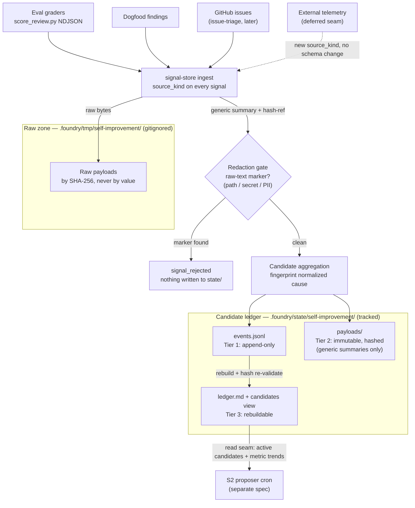
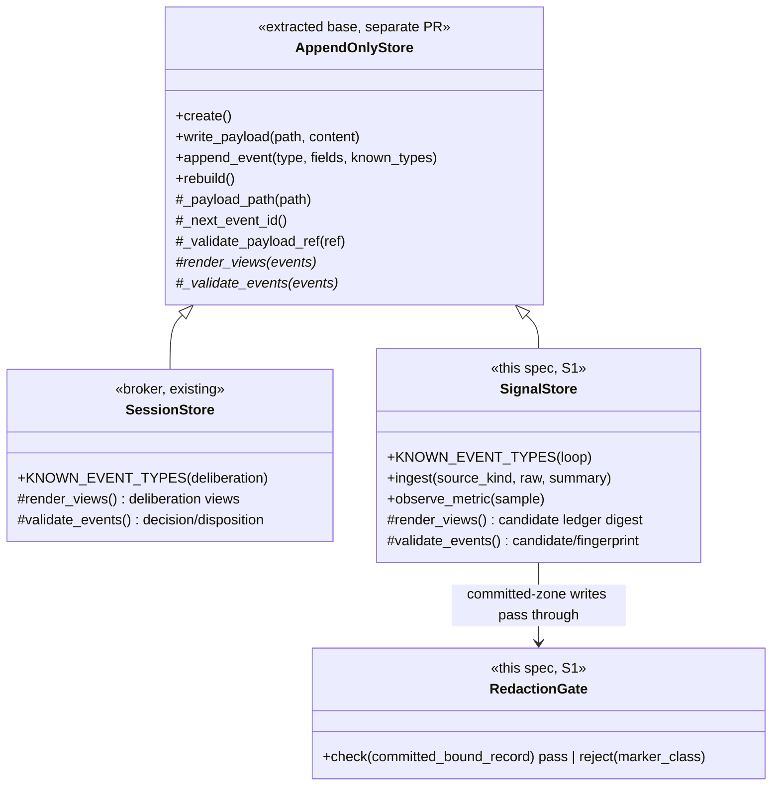
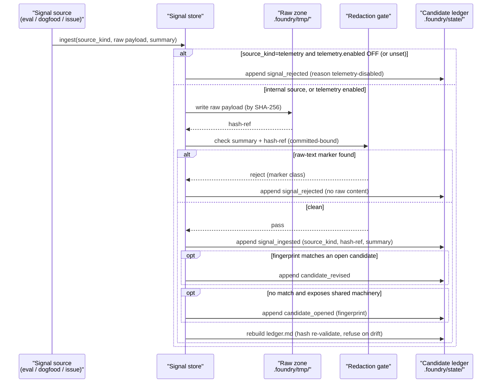

> **Status:** Ready (2026-06-20) — tracked on the [board](../../ROADMAP.md).
> Companion: [requirements.md](requirements.md), [tasks.md](tasks.md).

# Design — loop signal store (S1)

## Architecture overview

The signal store is the self-improving loop's durable memory. It reuses the
broker's storage discipline — append-only event ledger, immutable hashed payloads,
rebuildable views (`SessionStore`, `harness-deliberation-broker.py`) — but with a
loop-specific closed event set and one new structural property: it splits by signal
sensitivity across the existing gitignore boundary.

| Zone | Location | Contents | Committed? |
|---|---|---|---|
| **Raw zone** | `.foundry/tmp/self-improvement/` (already gitignored, `.gitignore`) | Raw signal payloads: conversation excerpts, issue bodies, eval transcripts. Referenced by SHA-256, never by value. | No |
| **Candidate ledger** | `.foundry/state/self-improvement/` (tracked — `.foundry/state/` is not in `.gitignore`) | The generic-by-construction event ledger of candidates and metrics: generic summaries, hash-refs into the raw zone. | Yes |

The candidate ledger is the machine-readable sibling of a COE — "a dated record of
a real failure the setup permitted… closed only by a mechanical change"
(`knowledge/glossary.md`). A candidate is a pre-COE signal of the same kind:
committing it survives clones, makes ranking reviewable in pull requests, and the
genericity rule guarantees it carries nothing user-specific. Putting the
leakage-prone raw zone under already-gitignored `.foundry/tmp/` means committing raw
data requires defeating gitignore — a stronger guarantee than "remember not to
commit."

The **redaction gate** is the only writer of clean committed records. Every clean
record bound for `.foundry/state/` passes the gate first; a record that carries a
raw-text marker is rejected and recorded as `signal_rejected`, never written. (The
telemetry opt-in gate, §Telemetry opt-in gate, runs ahead of it and may write a
`signal_rejected` rejection of its own.) The gate ships with its own discriminating
eval: a seeded raw-leak (a path, secret, or PII string in a committed summary) must
make the gate fail.



## Components

| Component | Location | Purpose |
|---|---|---|
| Signal store | `plugins/foundry/scripts/loop-signal-store.py` | The S1 store: append-only ledger, immutable payloads, rebuildable views, ingest, candidate aggregation. Built on storage mechanics copied from the broker (see Dependencies). |
| Redaction gate | inside `loop-signal-store.py` | The single writer of clean committed records. Rejects any committed-bound record carrying a raw-text marker; records `signal_rejected`. |
| Telemetry opt-in gate | inside `loop-signal-store.py`, ahead of the redaction gate | Refuses a `telemetry` signal unless `telemetry.enabled` (`.foundry/self-improvement-config.json`) is ON; records `signal_rejected` reason `telemetry-disabled`. Internal sources are unaffected. |
| Raw zone | `.foundry/tmp/self-improvement/` (gitignored) | Raw signal payloads, by SHA-256. |
| Candidate ledger | `.foundry/state/self-improvement/` (tracked) | `events.jsonl`, `payloads/`, rebuildable `ledger.md`. |
| Store test | `tests/loop_signal_store_test.sh` | Proves append-only / immutable / rebuildable behavior and zone separation, with a seeded-defect arm (a mutant that writes raw bytes to `.foundry/state/` must fail). |
| Redaction-gate eval | `evals/harness/redaction-gate-eval.sh` + `evals/fixtures/redaction-gate/` | Discriminating eval: a seeded raw-leak in a committed summary must make the gate fail. |

## Committed-ledger layout

```text
.foundry/state/self-improvement/        # tracked, committed
  store.json                            # store_id, repo_root, schema version
  events.jsonl                          # Tier 1: append-only event ledger
  payloads/                             # Tier 2: immutable, hashed — generic summaries only
  ledger.md                             # Tier 3: rebuildable candidate-ledger digest

.foundry/tmp/self-improvement/          # gitignored
  payloads/                             # raw signal payloads, by SHA-256, never committed
```

The split is mechanical. The store's committed writer targets `.foundry/state/`; the
raw writer targets `.foundry/tmp/`. The committed writer is the redaction gate, so a
raw-bearing record cannot reach `.foundry/state/` without the gate firing. The raw
zone nests under already-gitignored `.foundry/tmp/`, matching the existing
`fresh-session` and `harness-deliberation` raw zones.

## Storage mechanics — reuse the pattern, not the closed event set

The broker's `SessionStore` already enforces the right discipline: `write_payload`
rejects any mutation of an existing payload (`harness-deliberation-broker.py`);
`append_event` assigns a monotonic id and rejects unknown types; `rebuild`
re-validates every payload hash and refuses if a Tier-3 view drifts;
`_payload_path` refuses an absolute path or `..`. S1 reuses all of this.

What S1 does **not** reuse is the vocabulary. `KNOWN_EVENT_TYPES` is a
deliberation-specific module constant checked at append and at rebuild, and
`_validate_events` hardcodes decision/disposition semantics. The clean cut is a
base — `AppendOnlyStore` owning `create / write_payload / append_event(known_types) /
_payload_path / _next_event_id / _validate_payload_ref` — with view-rendering and
event-validation as subclass hooks. The broker's `SessionStore` becomes base +
deliberation views; the signal store becomes base + loop views.



The class diagram shows the end-state after the extraction. Until that PR lands,
`SignalStore` carries the copied mechanics inline (no `AppendOnlyStore` parent) and
rebases onto the base when it ships — so the diagram's base/subclass split is the
target, not a build prerequisite.

**Sequencing:** the `AppendOnlyStore` extraction is a separate refactor PR, called
out under Dependencies. This spec does not specify that refactor. S1 starts on
storage mechanics copied from the broker, guarded by its own discrimination test,
and rebases onto the extracted base once it lands — so S1 is unblocked by the
broker's release train.

## Event types

A loop-specific closed set, mirroring the broker's append-and-rebuild validation
discipline:

| Event | Zone | Purpose |
|---|---|---|
| `store_started` | committed | Repo root, store id, schema version. |
| `signal_ingested` | committed | A signal entered. Carries `source_kind`, a hash-ref to the raw payload in the raw zone, and a generic summary. |
| `metric_observed` | committed | A numeric eval sample derived from the `summary` record `evals/harness/score_review.py` emits — `fixture`, `runs`, `mean_recall`, `decoy_hits`, `verdict`. |
| `signal_rejected` | committed | The redaction gate, a genericity/duplicate/scope check, or the telemetry opt-in gate (reason `telemetry-disabled`) fired. Names the marker class or reason; carries no rejected raw content. |
| `candidate_opened` | committed | A new aggregate problem, fingerprinted on the normalized cause. |
| `candidate_revised` | committed | New evidence, score, scope, recurrence, or trend folded into an existing candidate. |
| `candidate_closed` | committed | Resolution: duplicate, fixed, rejected, or shipped. |

`source_kind` is the **external-telemetry seam.** Its closed set is `eval`,
`code-review`, `spec-review`, `dogfood`, `issue-triage`, `telemetry`. Telemetry plugs
in later as the `telemetry` value behind the same redaction gate — no schema change.
`issue-triage` plugs in the same way; its own spec owns the read-only `gh` ingest
that produces the raw payload.

## Telemetry opt-in gate

`telemetry` is **opt-in, default OFF** — the one **external-contribution** source,
whose raw payload originates outside the repo and could leave it. The five internal
sources (`eval`, `code-review`, `spec-review`, `dogfood`, `issue-triage`) are local and
generic-by-construction through the redaction gate; they never leave the repo and are
**always on**, unaffected by the flag.

The store reads a single `telemetry.enabled` boolean from
**`.foundry/self-improvement-config.json`** — a repo-local config file. It is *not* the
manifest: `.foundry/manifest.json` is a managed lockfile (`/foundry:update` writes it
to tell pristine from customized — see `knowledge/glossary.md` *Manifest*), the wrong
home for a user-set preference. A subsystem-scoped `*-config.json` matches the
established repo-local config convention — a verbatim tool's per-repo variation lives in
a scoped seed config (`knowledge/knowledge-config.json`, `knowledge/.vitepress/site.json`;
`roadmap/specs/foundry-core/design.md` §Template classes). A missing file or unset key
reads as OFF — a repo with sensitive data must opt in.

The gate is mechanical and lives in the ingest path, before the redaction gate:

- `source_kind=telemetry` and `telemetry.enabled` OFF (or unset) → refuse ingestion,
  record `signal_rejected` with reason `telemetry-disabled`, write nothing else to
  `.foundry/state/`.
- `source_kind=telemetry` and `telemetry.enabled` ON → ingest normally, through the
  redaction gate like any other source.
- an internal `source_kind` → ingest regardless of the flag.

S1 only **reads** the flag. The bootstrap/update **prompt** that sets it (default off)
is owned by the external-telemetry epic, recorded under Dependencies — S1 does not
implement the prompt.

## Candidate identity and fingerprinting

A candidate aggregates signals by **normalized cause, not conversation.** The
fingerprint is `source_kind + invariant + failing_signature + affected_surface`. A
candidate opens only when a signal exposes shared machinery with a reproducible
mechanical catch — as issue #6 did with the timeout regression test
(`tests/harness_deliberation_timeout_test.sh`); a lone dogfood crash without that
catch does not. A new signal whose fingerprint matches an open candidate folds in via
`candidate_revised`; it does not open a duplicate.

A candidate record carries: `candidate_id`, status, title, problem statement,
evidence event ids, source fingerprints, first-seen and last-seen, severity,
recurrence, metric trend, genericity rationale, repro command, eval hook, estimated
effort, and score inputs. Storing the score inputs keeps the proposer's later
ranking challengeable. The eval hook is what lets S2 enforce evalability — a
candidate with no seedable discriminating eval cannot become a proposal — but that
filter lives in the S2 spec, not here.

## Redaction gate

The gate is the single writer of *clean* committed records and the structural defense
against raw-signal leakage. Every clean record bound for `.foundry/state/` — an ingest
summary, a metric record, a candidate summary — passes the gate first. The telemetry
opt-in gate runs ahead of it and may write a `signal_rejected` rejection
(`telemetry-disabled`) directly, refusing a telemetry signal before any clean record
forms.

The gate rejects on a raw-text marker:

- An absolute filesystem path (a leaked local path).
- A recognized secret token (key/token patterns).
- An email address or other PII pattern.

On rejection the gate writes nothing to `.foundry/state/` and records a
`signal_rejected` event naming the marker class (the event names the class, never the
matched raw text). The gate also rejects on duplicate, overfit, private, or
out-of-scope, each as a `signal_rejected` reason.

The gate is a behavior-changing mechanism, so it ships with its own discriminating
eval. The fixture seeds a committed summary that carries a planted raw-leak — a path,
a secret, and a PII string — plus clean decoys. The eval fails if a planted leak
passes the gate, and fails if a clean decoy is wrongly rejected. Green-ness is not
the evaluator; discrimination is.

## Data flow — ingest to committed candidate



## Read seam for downstream

S2 (proposer cron) reads the store through the rebuildable committed view — active
candidates and their metric trends from `ledger.md` and the events under
`.foundry/state/` — not by parsing raw payloads. On a fresh clone with no
`.foundry/tmp/` raw zone, the committed ledger still exposes every candidate, because
the candidate records are self-contained generic summaries; only the raw payloads
they hash-ref are absent, and the read seam never needs them. This is why the ledger
is committed: the loop's input is identical on every machine.

## Dependencies

- **`AppendOnlyStore` base-class extraction (separate refactor PR).** The base class
  extracted from the broker's `SessionStore` — `create / write_payload /
  append_event(known_types) / _payload_path / _next_event_id /
  _validate_payload_ref`, with view-rendering and event-validation as subclass hooks.
  S1's build depends on it but does not specify it. S1 starts on copied mechanics and
  rebases onto the base when it lands. Deferring the extraction past the broker's
  in-flight release avoids coupling S1 to the release train.
- **Telemetry opt-in prompt (external-telemetry epic).** The bootstrap/update prompt
  that writes `telemetry.enabled` to `.foundry/self-improvement-config.json` (default
  off) belongs to the external-telemetry epic, not S1. S1 only reads the flag; until
  the prompt ships, the absent file reads as OFF, so the default-off behavior holds
  with no prompt.

## Testing strategy

Each test carries a seeded defect the gate catches. Green-ness is not the evaluator;
discrimination is.

`tests/loop_signal_store_test.sh` (new) runs against a temp store dir and asserts:

1. An appended event lands in `events.jsonl` with a monotonic id; a rewrite attempt
   is refused.
2. A payload rewritten with different bytes is refused (immutable-payload
   violation).
3. A rebuild re-validates payload hashes and refuses when a committed view differs
   from the recomputed view.
4. An unknown event type is rejected at append and at rebuild.
5. Zone separation: raw payloads land under `.foundry/tmp/self-improvement/`; the
   committed ledger lands under `.foundry/state/self-improvement/`; no raw signal
   text lands in the committed zone.
6. Fingerprint aggregation: a second signal matching an open candidate's fingerprint
   folds in via `candidate_revised` rather than opening a duplicate.
7. **Seeded defect** — a mutant store that writes raw payload bytes into
   `.foundry/state/` (defeating the split) makes the test fail.

`evals/harness/redaction-gate-eval.sh` + `evals/fixtures/redaction-gate/` (new)
seed a committed summary carrying a planted raw-leak — an absolute path, a secret
token, and a PII string — plus clean decoys. The eval fails if any planted leak
passes the gate, and fails if a clean decoy is wrongly rejected. This is the gate's
own discriminating eval per the standing rule that a behavior-changing mechanism
ships with one.
