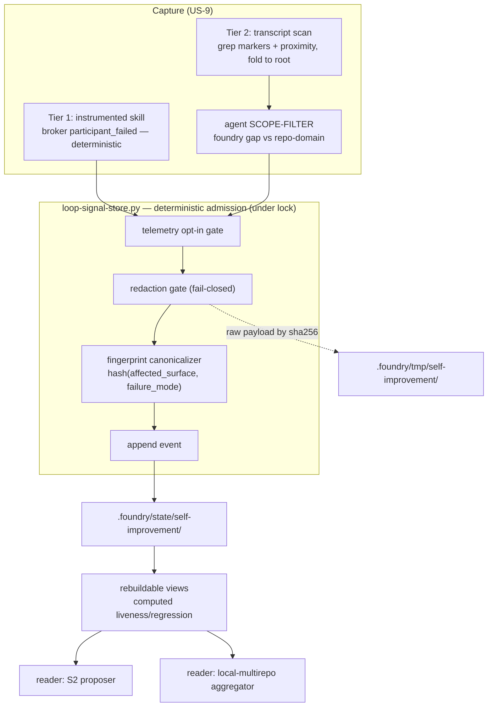
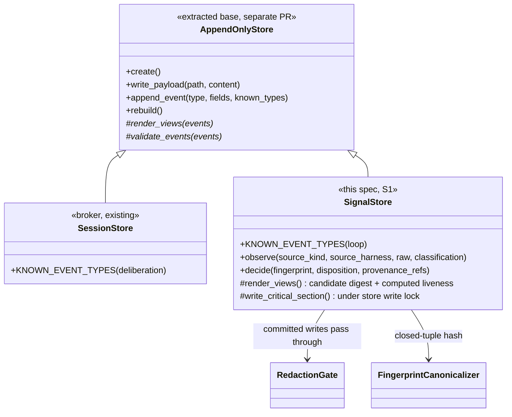

> **Status:** Ready (2026-06-21) — tracked on the [board](../../ROADMAP.md).
> Companion: [requirements.md](requirements.md), [tasks.md](tasks.md).

# Design — loop signal store (S1)

## Architecture overview

S1 is one **per-repo, append-only, two-zone store** plus a deterministic CLI that owns
admission. It reuses the broker's storage discipline — append-only event ledger, immutable
hashed payloads, rebuildable views (`SessionStore`, `harness-deliberation-broker.py`) — with
a loop-specific closed event set, and unlike the broker's single-writer per-session store it
is one shared store many sources write to concurrently, so it serializes writes under an
advisory lock (§Concurrency model).

| Zone | Location | Contents | Committed? |
|---|---|---|---|
| **Raw zone** | `.foundry/tmp/self-improvement/` (gitignored) | Raw payloads: conversation excerpts, transcripts, issue bodies. By SHA-256, never by value. | No |
| **Candidate ledger** | `.foundry/state/self-improvement/` (tracked) | The closed-schema event ledger: bounded fields, hash-refs into the raw zone. | Yes |

Everything that can change consent, identity, counters, attribution, or committed state
happens in the CLI — agents draft, the script admits (the `reg-determinism` line). The store
is a plain portable CLI any harness, git hook, human, or CI can run, so it behaves identically
under Claude Code and Codex. Three properties keep S1 small and verifiable:

- **Closed-schema committed record.** Committed records carry only enums, hashes, counters,
  and bounded fields — never free text. Closing the channel is the privacy lever; the
  redaction gate guards what a closed field cannot. Putting the raw zone under
  already-gitignored `.foundry/tmp/` means leaking raw data requires defeating gitignore.
- **Computed liveness, no version comparison.** The append-only log is already a total order.
  "Live / addressed / regressed" is computed from the event stream within a recency window. A
  build identity is stored as an **opaque label, never compared** in v1 — the only seam a
  later multi-version phase needs, with no ordering machinery now.
- **Fingerprint = a script-canonicalized closed tuple.** A candidate is keyed by the
  normalized cause, repo-independent by construction, so the same gap fingerprints identically
  across repos (the join key the sibling cross-repo spec reads). The spike proved it: agents
  produce divergent free-form slugs for one cause while a closed enum aligns — so the *agent
  fills a closed enum* and the *script hashes the tuple*.



## Components

| Component | Location | Purpose |
|---|---|---|
| Store CLI | `plugins/foundry/scripts/loop-signal-store.py` | Admission, redaction, fingerprinting, append under lock, view rebuild, read |
| Tier-1 emitters | callers (e.g. `harness-deliberation-broker.py`) | A foundry skill calls `loop-signal-store observe …` directly from a structured failure event |
| Tier-2 capture | a Stop-hook narrower + an agent draft | Grep-proximity narrow → agent scope-filter → `observe` (ambient friction) |
| Redaction gate | inside the CLI (committed-zone writer) | Reject free-text / path / secret / PII; the only committed-zone writer |
| Telemetry opt-in gate | inside the CLI, ahead of redaction | Refuse `telemetry` unless `telemetry.enabled`; record `signal_rejected` reason `telemetry-disabled` |
| Fingerprint canonicalizer | inside the CLI | `sha256` of the canonical `(affected_surface, failure_mode)` tuple |
| Store write lock | `.foundry/state/self-improvement/store.lock` | Advisory `flock` serializing the write critical section |
| Store test / redaction eval | `tests/loop_signal_store_test.sh`, `evals/harness/redaction-gate-eval.sh` | Discriminating tests with seeded defects |

## Committed-ledger layout

```text
.foundry/state/self-improvement/        # tracked, committed
  store.json                            # store_id, repo_root, schema version
  store.lock                            # advisory flock — not committed (gitignored)
  events.jsonl                          # Tier 1: append-only event ledger
  payloads/                             # Tier 2: immutable, hashed — bounded records only
  ledger.md                             # Tier 3: rebuildable candidate digest
.foundry/tmp/self-improvement/          # gitignored
  payloads/                             # raw payloads, by SHA-256, never committed
```

## Event types (closed v1 set)

A small closed set; an unknown type is rejected at append and rebuild. Every event has
`event_id` (monotonic), `created_at`, `store_id`, and is appended inside the store write lock.

| Event | Purpose |
|---|---|
| `store_started` | Repo root, store id, schema version. |
| `candidate_observed` | One observation of a candidate (the admit path). Folds into a candidate by fingerprint. Carries the closed schema below. |
| `candidate_decision` | The one resolution event: `resolved \| dismissed \| duplicate \| wontfix`. Liveness/regression are *computed* from the stream, never stored as `reopened`/`suppressed`/`regressed`. |
| `signal_rejected` | The redaction gate or the telemetry opt-in gate fired. Names the marker class / reason only; carries no raw content. |

This collapses the earlier model's ingest/aggregate events
(`signal_ingested`/`metric_observed`/`candidate_opened`/`candidate_revised`/`candidate_closed`)
into `candidate_observed` + `candidate_decision`: an observation *is* the candidate's evidence
(opened = first observation of a fingerprint; revised = a later one), and resolution is one
decision with status computed (the `simplicity-audit` line).

### `candidate_observed` — the closed schema

Bounded fields only, no free text:

| Field | Kind | Notes |
|---|---|---|
| `candidate_fingerprint` | hash | `sha256(canonical(affected_surface, failure_mode))` |
| `fingerprint_version` | int | the canonicalization algorithm version |
| `affected_surface` | enum | the controlled vocab (below) |
| `failure_mode` | enum | closed, **per**-`affected_surface` |
| `category` | enum | `bug \| confusion \| missing-capability \| ambiguous-convention \| workflow-friction` |
| `evidence_kind` | enum | `error \| repeated-question \| manual-workaround \| wrong-output \| explicit-user-feedback` |
| `conversation_id` | hash | `hash(harness-native session id)`, adapter-stamped |
| `root_conversation_id` | hash | subagent/child folds here; `= conversation_id` if no parent |
| `source_kind` | enum | `eval \| code-review \| spec-review \| dogfood \| issue-triage \| telemetry` |
| `source_harness` | enum/null | `claude-code \| codex \| system`; adapter-stamped, agent-supplied rejected |
| `build_kind` / `build_label` | enum / opaque | stored, **never compared** in v1 |
| `convention_version` | int | stamped, never gated in v1 |
| `origin` / `origin_chain` | enum / list | carries `loop_generated` (design-output quarantine) |
| `raw_payload_ref` | path+sha256 | reference into the gitignored zone |

`candidate_decision`: `candidate_fingerprint`, `disposition`, `decision_source`
(`human | coe | board`), `provenance_refs[]` (bounded: `coe_id | board_card | release_tag |
spec_slug | eval_id` — never a raw path).

**Closed enums.** `affected_surface` is the spike's controlled vocabulary
(`harness-deliberation`, `spec-driven-dev`, `spec-review`, `code-review`, `update`,
`bootstrap`, `handoff`, `spawn-isolation-worktree`, `check-fast-gates`, `glossary-naming`,
`board-roadmap`, `code-skill`, `release-versioning`, `auto-memory`, `plugin-install`,
`features-gherkin`, `vitepress-docs`, `other`). `failure_mode` is closed **per** surface. New
enum values are additive, not a schema break.

## Capture pipeline (US-9)

| Tier | Source | Deterministic part | Judgment part |
|---|---|---|---|
| 1 | instrumented skill (broker `participant_failed`, a gate's nonzero exit) | the whole capture | none |
| 2 | conversation transcript | grep markers + proximity, fold to root, top-N spans | the scope-filter |

The **scope-filter is distinct from the genericity gate** (AC-9.3): it decides in/out of the
foundry-mechanism domain; overfit is S2's judgment. Tier 2 surfaces top-N spans *relative to
the transcript* (no absolute threshold — the spike found positive scores 13–434 across repos)
and attributes to `root_conversation_id` (the spike's noisy "controls" were subagent
transcripts — root-collapse is load-bearing).

**Quarantine scope (AC-5.5/5.6).** `loop_generated` quarantines a candidate whose evidence is
the loop's own *design output* re-entering. It does **not** quarantine a foundry skill's
*operational failure* during loop execution — a broker crash inside a deliberation is a
first-class capability-gap signal.

## Candidate identity and fingerprinting

`candidate_fingerprint = sha256(canonicalize(affected_surface, failure_mode))`. Canonicalize
excludes raw text, paths, repo names, timestamps, local identifiers, and the conversation id,
so the fingerprint is repo-independent — the cross-repo join key. The agent classifies into the
closed enums; the script hashes. `fingerprint_version` stamps the algorithm so it can evolve
without orphaning events. A cause whose enum tuple is unknown is rejected — the canonicalizer
is also a closed-vocabulary gate. A new observation whose fingerprint matches an open candidate
folds in; it does not create a second candidate.

## Liveness and regression (computed)

The append-only log is the source of truth; status is recomputed, never stored.

- **Live** — a candidate's in-window distinct-`root_conversation_id` count reaches the
  threshold N and no later `candidate_decision` applies. The **recency window** (a
  maintainer-configurable count of distinct roots or number of days, default stated) replaces
  any version-recency notion; observations age out by event order.
- **Quiet** — an effective `candidate_decision` and no later qualifying observation.
- **Regression-suspected → `for_review`** — a `candidate_observed` postdates the last
  `candidate_decision` within the window. One post-decision observation flags review; it never
  auto-acts, auto-resolves, or auto-suppresses. Automatic action on the resolution signal is
  refused in v1 (it would need version comparison, deferred).

## Storage mechanics — reuse the pattern, not the closed event set

The broker's `SessionStore` enforces the right discipline: `write_payload` rejects mutation of
an existing payload; `append_event` assigns a monotonic id and rejects unknown types; `rebuild`
re-validates payload hashes and refuses on view drift; `_payload_path` refuses an absolute path
or `..`. S1 reuses all of it. What S1 does not reuse is the vocabulary. The clean cut is a base
— `AppendOnlyStore` owning `create / write_payload / append_event(known_types) / _payload_path /
_next_event_id / _validate_payload_ref` — with view-rendering and event-validation as subclass
hooks. Until that extraction PR lands (Dependencies), `SignalStore` carries the copied mechanics
inline and rebases onto the base later, so S1 is unblocked by the broker's release train.



The store write lock lives in `SignalStore`, not the base — the broker is single-writer and
needs no lock, so adding it to `AppendOnlyStore` would burden the broker with an unused
guarantee.

## Concurrency model

The broker assumes one session, one writer. S1 breaks that: one shared store, many concurrent
sources (eval graders, code-review/spec-review hooks, dogfood, issue-triage, telemetry). Three
races follow, none closed by `O_APPEND` alone: a **torn ledger line** (a record exceeding the
atomic-append size), a **duplicate candidate** (two ingests of one new fingerprint both fold-or-
open), and a **payload write-if-absent TOCTOU**.

S1 serializes the write critical section behind a **store write lock** — an advisory `flock` on
`store.lock`: acquire → read view → decide fold → write-if-absent payload → append → release.
Holding the lock across read→decide→append collapses all three races. **Reads are lock-free**
over the append-only ledger (a reader sees a complete trailing line or stops at the prior
newline). The lock is crash-safe: `flock` releases on process death; a partial trailing append
is detected by JSON/hash validation at rebuild and ignored; a rebuilt view is written atomically
(temp + rename). The guarantee is **process-level cooperative** locking — the store API is the
sole sanctioned writer, and the discrimination test proves the lock is held by failing when it
is dropped. **Single-host scope (v1):** the `flock` serializes writers on one filesystem;
cross-machine concurrent writes to the committed ledger are a git-merge concern, out of v1 scope.

## Telemetry opt-in gate

`telemetry` is opt-in, default OFF — the one external-contribution `source_kind`, whose raw
payload originates outside the repo. The five internal sources are local and
generic-by-construction through the redaction gate, and are always on. The store reads a single
`telemetry.enabled` boolean from `.foundry/self-improvement-config.json` (a repo-local config,
*not* the managed `.foundry/manifest.json`); a missing file or unset key reads as OFF. Ahead of
the redaction gate: `telemetry` with the flag off → refuse, record `signal_rejected` reason
`telemetry-disabled`, write nothing else to `.foundry/state/`; `telemetry` with the flag on →
ingest through the redaction gate; an internal source → ingest regardless. S1 only reads the
flag; the bootstrap/update prompt that sets it (default off) is the external-telemetry epic's.

## Redaction gate

The single writer of clean committed records and the structural defense against leakage. Every
committed-bound record passes it. It rejects fail-closed on a free-text field (the closed schema
admits none), an absolute path, a recognized secret token, or a PII pattern; on rejection it
writes nothing to `.foundry/state/` and records `signal_rejected` naming the marker class only
(never the matched text). It ships its own discriminating eval (Testing strategy).

## Data flow — observe to committed candidate

```mermaid
sequenceDiagram
  participant Src as "Source (Tier 1 skill / Tier 2 agent)"
  participant CLI as "loop-signal-store.py"
  participant Raw as "Raw zone .foundry/tmp/"
  participant Lock as "store.lock (flock)"
  participant State as "Ledger .foundry/state/"
  Src->>CLI: observe(source_kind, source_harness, raw, classification)
  CLI->>Raw: write raw payload (by SHA-256)
  CLI->>Lock: acquire exclusive flock
  alt telemetry and flag OFF
    CLI->>State: append signal_rejected (telemetry-disabled)
  else internal, or telemetry ON
    CLI->>CLI: redaction gate (committed-bound record)
    alt marker found
      CLI->>State: append signal_rejected (marker class, no raw text)
    else clean
      CLI->>CLI: canonicalize fingerprint (closed tuple), stamp source_harness
      CLI->>State: write-if-absent payload; append candidate_observed
      CLI->>State: rebuild ledger.md (atomic; recompute liveness)
    end
  end
  CLI->>Lock: release flock
```

The raw-zone write precedes the telemetry and redaction checks by design: a telemetry-OFF
refusal blocks only the committed write (AC-3.5), not the gitignored raw payload, which never
leaves the host.

## Read seam

S2 and the local-multirepo aggregator read the rebuildable committed view — live candidates,
evidence, the per-`source_harness` breakdown — never the raw zone. On a fresh clone with no raw
zone the committed ledger still exposes every candidate (self-contained bounded records). The
aggregator's `source_repo` is a read-time annotation; S1 emits no such field.

## Testing strategy

Each gate ships a **discriminating** eval — a seeded defect must make it fail (never graded by
green-ness); where an algorithm is verified, the oracle is independent of the code under test.

| Eval | Discrimination |
|---|---|
| Redaction (keystone) | a planted path/secret/PII/free-text field in a committed record is rejected; a clean decoy passes — a no-op gate fails |
| Fingerprint canonicalization | two divergent free-form slugs for one cause yield one fingerprint; two distinct causes do not collide |
| Conversation dedupe | retries + spawned children share one `root_conversation_id`; a mutant counting raw occurrences inflates the bar and fails |
| Telemetry zero-bytes | positive control: off ⇒ nothing committed; on ⇒ the same observation admits |
| Quarantine scope | a loop *design-output* candidate is quarantined; an *operational failure* inside the loop is captured |
| Concurrency | N writers ⇒ no torn line, one candidate per fingerprint, consistent rebuild; a lock-dropped mutant fails |
| Storage discipline | append-only / immutable-payload / rebuildable-view violations rejected (modeled on the broker store tests) |

**Vertical slice (Wave 1 — the first build):** instrument the broker's `participant_failed` →
a `candidate_observed` (Tier 1, `source_kind=dogfood`, `source_harness=claude-code`,
`affected_surface=harness-deliberation`, `failure_mode=per-turn-budget-exceeded`) → the candidate
view surfaces the budget-cap gap. The broker already emits the event (2 such failures recorded
this session); this slice proves capture → S1 → candidate end-to-end on a skill we own,
dogfooding first. Its first surfaced candidate would be "raise the default per-turn budget."

## Dependencies

- The two-zone convention (`.foundry/tmp/` gitignored, `.foundry/state/` committed).
- `.foundry/manifest.json` `harnesses` (the `source_harness` adapter check).
- The `reg-determinism` partition and closed-schema rule govern admission.
- **`AppendOnlyStore` extraction (separate refactor PR)** — S1 starts on copied broker
  mechanics and rebases onto the base when it lands; not specified here.
- **Telemetry opt-in prompt (external-telemetry epic)** — S1 only reads the flag; absent file
  reads as OFF.
- Consumed by the sibling `local-multirepo-aggregate` spec (reads the committed ledger,
  unchanged) and later S2.
