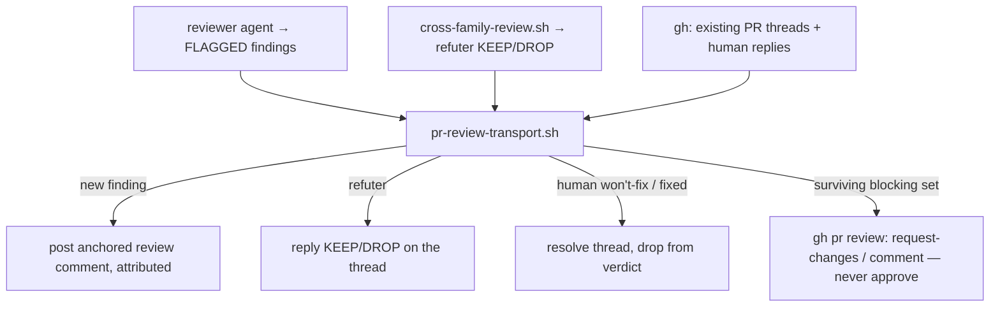

> **Status:** Planned (2026-06-29) — design pending approval; tracked on the [board](../../ROADMAP.md).
> Companion: [requirements.md](requirements.md), [tasks.md](tasks.md).

# Design — pr-deliberation

## Decisions

- **A transport over the existing review logic — not a new reviewer (the central call).** The
  reviewer and the cross-family refuter already produce exactly what a PR thread needs: a finding
  with a `file:line`, a severity, evidence/problem/fix, a `FLAGGED:` signature, and a KEEP/DROP
  verdict. A deterministic **`pr-review-transport.sh`** maps those onto PR review comments — post,
  reply, read replies, dedupe, resolve, verdict. The LLM judgment (find / refute) is unchanged and
  stays in the agents; the transport is pure plumbing (and therefore mock-`gh`-testable). It reuses
  `cross-family-review.sh` (the refuter spawn) and `footer-algebra` (the surviving-set via
  `difference`, plus a small `signature` subcommand reusing its `normalize` so the thread-dedupe
  key has one source of truth, not a re-implementation).
- **Reuse the single-asymmetric-refute discipline; reject a new agent debate.** `review-convergence`
  already settled that the refuter is **one DROP-only pass, not a debate**. PR deliberation keeps
  that: per run, the reviewer posts findings, the refuter replies once per thread (KEEP/DROP), the
  verdict posts once. The "back and forth" the user wants is the *reviewer↔refuter* exchange made
  visible, plus *human↔agent* — which is **async and turn-based** (the human replies; the next run
  ingests). No real-time agent-vs-agent loop — that would be unbounded in cost and noise.
- **Never auto-approve.** The verdict maps `FAIL → gh pr review --request-changes`,
  `PASS → --comment`. Approval stays the human's — the agents inform, the human decides.
- **Attribution lives in the comment body.** Both agents post under the user's single `gh` token,
  so identity can't come from the GitHub author. A prefix (`reviewer (claude)` / `refuter (codex)`)
  carries it, so the human can follow who said what.
- **Idempotent by anchor + signature.** A finding's thread key is `file:line` + the `footer-algebra`
  normalized signature; a re-run lists the PR's existing review comments, matches, and skips a
  duplicate, resolves a thread whose finding is gone or human-resolved. No new state store — the PR
  *is* the state.

## Mechanism

| Surface | Change |
|---|---|
| `plugins/foundry/scripts/pr-review-transport.sh` | New: given the reviewer findings + refuter KEEP/DROP + the PR's existing threads (via `gh`), post/update anchored comments (attributed), reply, ingest human replies, dedupe by `file:line`+signature, resolve fixed/won't-fix, compute + post the verdict (never approve). |
| `plugins/foundry/skills/code-review/SKILL.md` + `scripts/spawn-code-reviewer.sh` | A `--pr <#>` mode: run the reviewer + the cross-family refuter as today, then deliver via the PR transport instead of `.foundry/reports/`. |
| `tests/pr_review_transport_test.sh` | Hermetic: a mock `gh` seam — findings → anchored comments; DROP excluded from the verdict; idempotent re-run; human "won't fix" drops the finding; verdict never approves. |
| `knowledge/glossary.md` | `Finding thread`, `Review transport`. |

`gh` is the transport at the edge; a `GH_CMD` seam (default `gh`) lets the test substitute a fake.

## Metrics

Discrimination, not green-ness: the mock-`gh` test asserts one anchored comment per `FLAGGED`
finding, a DROP'd finding absent from the verdict, zero duplicate comments on a re-run, a
"won't fix" reply dropping the finding, and a verdict that is request-changes/comment — never
approve. Transport is `gh` calls bounded by finding count (≤ one comment + one refuter reply per
finding) — not a hot path; perf N/A.

## Out of scope

- Real-time agent-vs-agent debate (rejected — the refuter is one DROP-only pass).
- Generalizing the transport to other deliberations (e.g. design via PR) — a later card; this spec
  scopes to `code-review` on a PR.
- Auto-resolving GitHub "resolve conversation" UI state beyond posting a resolved-marker reply
  (the API for thread resolution is a follow-up if needed).
