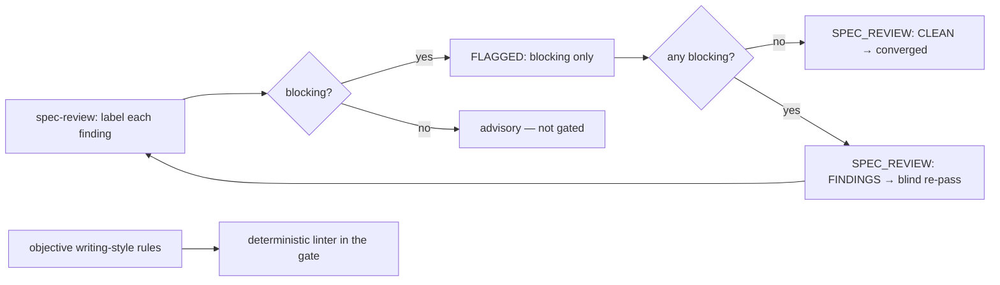

> **Status:** Planned (2026-06-27) — design pending approval; tracked on the [board](../../ROADMAP.md).
> Companion: [requirements.md](requirements.md), [tasks.md](tasks.md).

# Design — review-convergence

## Decisions

- **Adopt code-review's severity gating, not a new scheme.** `code-review` already classes
  findings `blocking`/`advisory` and fails its verdict only on a surviving blocking finding
  ("severity is the gate, not finding count"). spec-review adopts that severity model and
  carries the `blocking` findings in its `FLAGGED:` footer (the convergence loop and
  `score_review.py` read the footer). This reuses code-review's vocabulary rather than
  inventing a second one; it does not change code-review.
- **`CLEAN` = no blocking, not no findings.** A binary gate over taste-level prose cannot
  converge (judges disagree on nits indefinitely). Gating on `blocking` lets advisory nits
  persist without blocking the Design gate — the Conventional-Comments / Google-`Nit:` model.
- **Blind by construction — for both review skills.** The convergence hooks already re-spawn
  a fresh reviewer each round; the failure was a *human* priming the re-review with a change
  summary. **`code-review` shares this gap** — its re-review is blind only by the runner, not
  by contract, and its refuter is DROP-only (it removes false positives, never recovers a
  missed finding). Both `spec-review` and `code-review` are amended to forbid priming — the
  reviewer gets artifact + contract only, and no primed inline pass substitutes for it. (A
  judge told what changed exhibits self-enhancement bias; the COE records the live instance.)
- **Objective prose → a linter; subjective and contextual prose → the judge.** A defined
  banned-filler-phrase set belongs in a gate lint (reproducible, no asymptote). Taste belongs
  to the judge as `advisory`. Debt-term misuse — though a contract violation — is *contextual*
  (the glossary scopes each term: "scaffold" only as a verb, "issue" only for board rows), so
  it cannot be deterministically linted; it stays a `blocking` judge call. Grounded in the
  documented "a too-subjective rule cannot be enforced" lesson.
- **No new caps.** The existing per-spec round counter and escalation stay; only the *stop
  condition* changes from "zero findings" to "no unresolved blocking" — which the stateless
  blind reviewer can emit directly (it re-reads the whole artifact each round; "new vs. old"
  would need state it does not have).
- **One cross-family pass, two combine-rules — a Strategy, not a shared driver.** The
  cross-family pass is extracted to the shared `cross-family-review.sh` (derive the
  complementary family + a context-isolated spawn, via `refuter-family.sh` +
  `spawn-fresh-session.sh`). The **combine-rule is a Strategy** = a set operation over
  `footer-algebra.sh`'s one normalized signature: code-review = **DROP** (`difference`;
  precision-up, recall-monotone-down — its risk is over-flagging a diff), spec-review =
  **UNION** (`union`; recall-up, precision-monotone-down — its risk is missing a contract
  violation). `footer-algebra.sh` stays **pure set algebra** — the surviving blocking set;
  each thin orchestrator maps it to its own verdict word (`CODE_REVIEW: PASS/FAIL` vs
  `SPEC_REVIEW: CLEAN/FINDINGS`), kept skill-side rather than parameterized into the shared
  module (the same don't-over-couple discipline). The rules are opposite because the failure modes are; each one-directional rule
  keeps its monotonicity guarantee, which is why a "both-directions" combine is rejected (it
  forfeits both). The goal prompt, output format (`DROP/KEEP` vs `FLAGGED:`), and set op are
  one cohesive bundle per kind — hence a Strategy, not three free knobs.
- **No shared review *driver* — compose, don't unify (rejected: Template Method).** A single
  orchestrator over spec-review and code-review was considered and **rejected**: only two uses
  (rule of three), and they diverge structurally — code-review converges with an *internal*
  inner loop, spec-review *externally* via `spec-convergence-hook.sh`. Unifying would force an
  `if-kind` conditional around the loop — the start of the "wrong abstraction" tangle
  (Metz/AHA). The genuinely shared *knowledge* already lives in shared sub-scripts
  (`cross-family-review.sh`, `footer-algebra.sh`, `refuter-family.sh`, `wait-for-report.sh`);
  each skill keeps a **thin orchestrator that composes them**, accepting a little transparent
  sequencing duplication (a little copying over a little dependency). Revisit a unified driver
  only if a third reviewer kind appears.
- **Enablement gate.** Like code-review's refuter, the spec-review UNION pass ships enabled
  only after an A/B eval proves recall-up with no decoy regression.

## Mechanism

| Surface | Change |
|---|---|
| `plugins/foundry/skills/spec-review/SKILL.md` | Output contract: each finding carries `blocking`/`advisory`; `FLAGGED:` lists blocking only; `CLEAN` = no unresolved blocking. The "Flag" section classes contract violations as blocking, taste as advisory. Fresh-context workflow: the re-pass is blind — **never** hand the reviewer a change summary. |
| `plugins/foundry/skills/code-review/SKILL.md` | Fresh-context workflow: the re-pass is blind — never hand the reviewer a change summary; replace the "review inline and say so" escape hatch with "hold the gate" when fresh context is unavailable (no primed inline pass). Severity gating is already present — unchanged (US-2 only). |
| `plugins/foundry/scripts/spec-convergence-hook.sh` | Verdict semantics now "CLEAN = no blocking"; the stop token is unchanged (it already reads the verdict line). Reword the human-facing CLEAN message from "house-style clean" to "no blocking findings remain" (advisory prose may persist); confirm the hook still converges and escalates correctly. |
| `scripts/prose-lint.py` (+ test, verbatim twins) | New deterministic linter: a defined banned-filler-phrase set (generic English multi-word hedges, no repo vocabulary, so the twin ships no repo-specific content); skips fenced code blocks; wired into `check-fast.sh` over `roadmap/specs` + `knowledge`. Debt-term linting was **dropped at build time**: the glossary scopes debt terms by context, so a deterministic scan false-positives — debt-term misuse stays a `blocking` judge call. |
| `evals/harness/spec-convergence-eval.sh` + `evals/fixtures/spec-convergence` | **Migrate the existing seeded hedge defect** (`SEEDED-DEFECT-HEDGE` / `SPEC_CONVERGENCE_SIGNATURE`): under the new rule a prose hedge is advisory, so a correct loop would emit `CLEAN` with it present and trip the eval's fake-clean branch. Re-cast it as a **blocking** contract violation (so `CLEAN` still requires its removal). Then add the blocking-holds / nit-converges / primed-vs-blind discrimination cases — the oracle must branch on severity: a **blocking** signature must be gone before `CLEAN`, an **advisory** signature may remain (the inverse of the current grep-presence-means-fail logic). |
| `knowledge/log.md` | Log the convergence change. **No `glossary.md` row** — `blocking`/`advisory` are generic industry terms with prior art (Conventional Comments / Google `Nit:`), so they earn no canonical row; this matches code-review's own no-row choice and the "no new canonical name" claim. |
| `evals/fixtures/reviewer/answer-key.json` + `reviewer-eval` | **Changes** — the recall set seeds prose violations (V7 passive/buried-point, V8 needless-qualifier, V9 prose-should-be-table) that the new contract demotes to **advisory**, so they leave the blocking-only footer and `score_review.py` would score them as misses (recall ~0.97 → ~0.7, i.e. 7 of 10 scored). Reassign only **V8** (needless-qualifier) to `prose-lint`'s discrimination set — a lintable objective rule. **V7** (passive/buried-point) and **V9** (prose-should-be-table) are *subjective* judge calls the linter cannot make (passive detection is deferred, Out of scope), so demote them to **advisory** judge output and drop them from the scored recall set — they have no deterministic home, and that is the point. reviewer-eval recall then measures **blocking contract-violations only**. `score_review.py` itself is unchanged; `spec-convergence-eval.sh` uses an independent grep oracle. |
| `plugins/foundry/scripts/cross-family-review.sh` (extracted) + `spawn-code-reviewer.sh` | Extract the cross-family pass from `spawn-code-reviewer.sh` into a shared helper: given the complementary family (`refuter-family.sh`), a goal prompt, and a combine-rule, spawn the context-isolated pass via `spawn-fresh-session.sh`. `spawn-code-reviewer.sh` calls it with the **DROP** rule (behavior unchanged — proven by its existing footer-algebra tests). |
| `plugins/foundry/skills/spec-review/scripts/spawn-spec-reviewer.sh` + `spec-review/SKILL.md` | Wire the shared helper with the **UNION** rule + a spec-review goal prompt (independent second-family review of the artifact + contract; emit its own `blocking` findings). The footer becomes the reviewer's `blocking` set ∪ the second family's; the verdict re-derives. Document the pass in `SKILL.md` (a sibling to code-review's refuter section). Single-family repo → skip (AC-5.2). |
| `evals/harness/spec-convergence-eval.sh` (cross-family A/B) | A/B case: a fixture where the reviewer's family misses a `blocking` finding the complementary family catches; the UNION pass must recover it (recall-up) with no decoy-hit regression — the enablement gate (AC-5.6), mirroring code-review's refuter A/B. |

## Metrics

Discrimination, not green-ness: the eval seeds a **blocking** contradiction (the loop must
emit `FINDINGS` and hold the gate), a pure **prose nit** (the loop must reach `CLEAN` with the
nit demoted to advisory), and a **primed-vs-blind** case (a re-pass given a change summary
misses a seeded contradiction the blind pass catches). The **cross-family A/B**: on a fixture
where the reviewer's family misses a `blocking` finding the complementary family catches, the
UNION pass recovers it (recall-up) with no decoy-hit regression — the AC-5.6 enablement gate,
mirroring code-review's refuter A/B. `prose-lint.py` has its own discrimination test: a seeded
banned phrase exits non-zero, clean prose passes. Runtime: lint and hook are one-shot parses —
perf N/A.

## Out of scope

- A full Vale rollout — `prose-lint.py` starts with a small banned-filler-phrase set,
  extensible later.
- Passive-voice detection and deterministic **debt-term** linting — both false-positive
  without context (passive is ambiguous; the glossary scopes debt terms by use), so both stay
  judge calls, not lints.
- A *DROP-only* refuter for spec-review — US-5's UNION cross-family pass supersedes it
  (spec-review's failure mode is misses, not false positives).
- Re-running spec-review across already-merged specs (a separate board/debt sweep).
