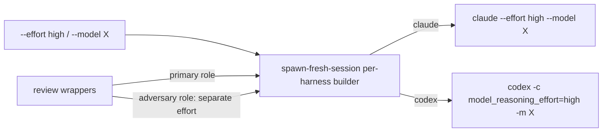

> **Status:** Planned (2026-06-28) — design pending approval; tracked on the [board](../../ROADMAP.md).
> Companion: [requirements.md](requirements.md), [tasks.md](tasks.md).

# Design — reviewer-effort

## Decisions

- **Neutral knob + per-harness map — the existing harness-agnostic pattern.** Foundry exposes
  `--effort <level>` / `--model <name>`; `spawn-fresh-session.sh`'s per-harness command builder
  maps them to each CLI's real flag — `claude --effort <level> --model <name>` vs
  `codex -c model_reasoning_effort=<level> -m <name>` (both confirmed in `--help`). This is the
  same place that already maps `--dangerously-skip-permissions`, so no new abstraction — one
  more row in the same switch.
- **Differential effort: spend it on the adversary.** The value is the *cross-family* pass —
  the refuter (precision) and the spec-review UNION second opinion (recall) are where a missed
  or wrongly-kept finding costs most, and where the LLM-judge research says extra reasoning pays
  off. The primary review can stay the base tier; the wrappers carry a **separate** role
  effort/model so only the adversary is dialed up.
- **Eval-gated default, like the refuter.** A higher-effort default ships only after an A/B
  proves a reliability gain — mirroring `review-convergence`'s "ships disabled until the A/B is
  green" discipline. Until then the knob exists but defaults to the harness base tier (zero cost
  change).
- **Level strings pass through; no Foundry taxonomy.** Foundry forwards the level verbatim to
  the harness, which validates it. Foundry coins no `low|medium|high` enum of its own (the two
  harnesses already differ — claude vs OpenAI reasoning tiers) — a harness rejects an unknown
  level, which surfaces as a launch error, not silent downgrade.

## Mechanism

| Surface | Change |
|---|---|
| `plugins/foundry/scripts/spawn-fresh-session.sh` | Parse `--effort`/`--model`; in the `claude`/`codex` command builders, append the mapped flags (default: omit → harness default). |
| `plugins/foundry/skills/code-review/scripts/spawn-code-reviewer.sh` | Accept `--effort`/`--model` for the primary review spawn. (The refuter's separate effort arrives via `cross-family-review.sh` once code-review adopts the helper — `review-convergence` T9b.) |
| `plugins/foundry/skills/spec-review/scripts/spawn-spec-reviewer.sh` | Accept `--effort`/`--model` for its primary review spawn. |
| `plugins/foundry/scripts/cross-family-review.sh` | Accept + forward a separate effort/model to the cross-family spawn (the adversary role). |
| `evals/harness/` cross-family A/B | Add a base-vs-higher-effort arm: does dialing up the adversary lift precision/recall, at what cost? |
| `knowledge/log.md` | Record the effort/model passthrough. |

## Metrics

Discrimination, not green-ness: a dry-run test asserts `--effort high` becomes `claude --effort
high` under `AGENT_HARNESS=claude` and `codex -c model_reasoning_effort=high` under
`AGENT_HARNESS=codex`, and that omitting the flag leaves the bare command unchanged. The A/B
eval measures the adversary's reliability at base vs higher effort on the cross-family fixture;
the higher tier becomes the default only on a proven gain. Runtime: flag mapping is a one-shot
string build — perf N/A.

## Out of scope

- Per-dimension or per-finding effort; auto-tuning effort by spec size.
- Cost budgeting (the harnesses expose budget flags) — a separate concern.
- A Foundry-defined effort taxonomy — levels pass through to the harness.
