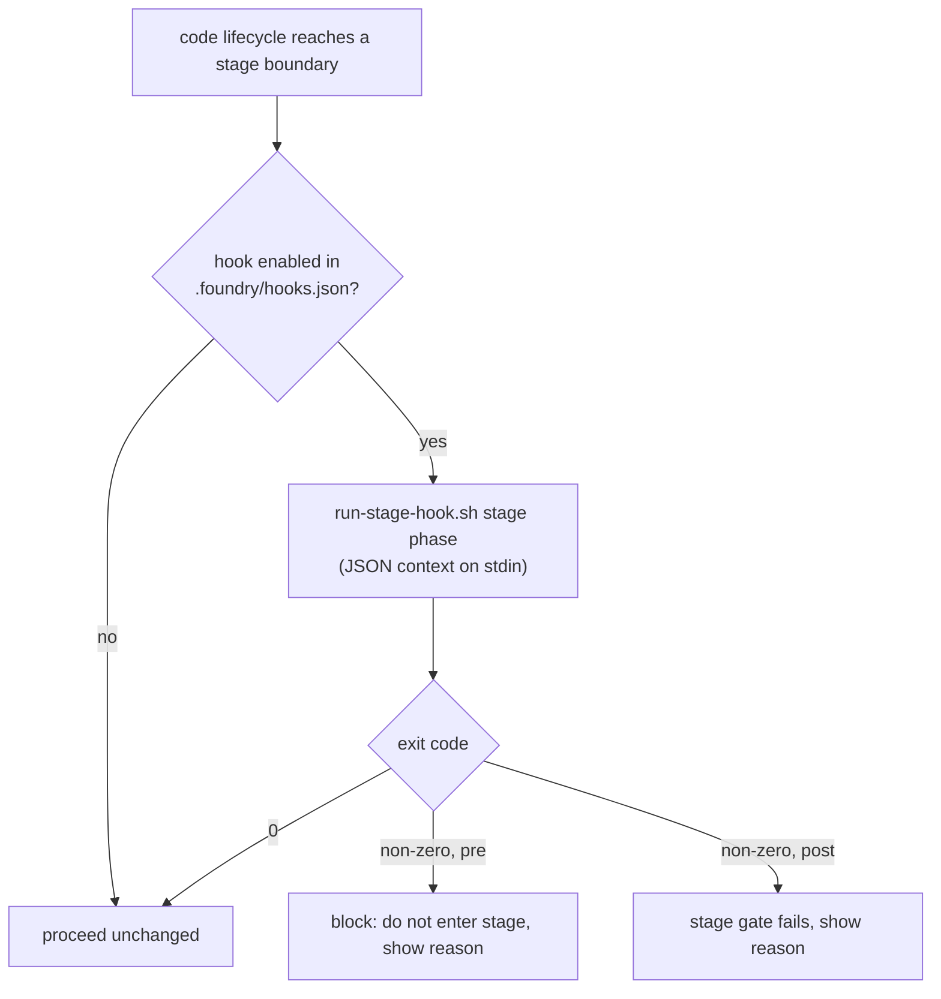

> **Status:** Planned (2026-06-28) — design pending approval; tracked on the [board](../../ROADMAP.md).
> Companion: [requirements.md](requirements.md), [tasks.md](tasks.md).

# Design — skill-hooks

## Decisions

- **A skill-run convention, not per-harness native-hook adapters (the central call).** Foundry's
  SDLC stages live in the `code` skill's checklist — they are *not* harness tool-events, so
  Claude/Codex `PreToolUse`/`PostToolUse` and pi's `tool_call` never fire at a "Verify boundary."
  The simplest mechanism that spans every harness is the lifecycle **running a consumer script**
  at the boundary — harness-agnostic by construction, no adapter. **Rejected: a Foundry gate
  abstraction with two adapters (declarative hook for claude/codex, TS extension for pi)** — it
  would be the wrong abstraction (Sandi Metz): it couples Foundry to three native-hook schemas to
  re-create a stage seam the skill already owns, for a layer (tool events) that does not align
  with stages. Tool-level gating is left to the harness's own hooks (documented).
- **Explicit opt-in in a consumer config — not the lockfile.** Running consumer scripts at
  lifecycle boundaries is security-sensitive; a hook executes only if listed in
  `.foundry/hooks.json`'s `enabled` array, so a dropped-in or vendored script never runs
  implicitly. Enablement is **not** in `.foundry/manifest.json`: the manifest is the
  update-discrimination lockfile (bootstrap-written, `update`-rewritten), so a hand-edited
  runtime toggle there would be clobbered — the telemetry opt-in set the precedent (its flag
  lives in a separate `.foundry/self-improvement-config.json`, off the lockfile).
- **The gate is the hard boundary; stage hooks are advisory-strength.** The agent runs stage
  hooks per the checklist, so they are as reliable as the lifecycle is followed. Hard,
  CI-enforced gating already exists — `check-fast` (branch-protected). A consumer needing hard
  Verify enforcement adds their check to the gate; `verify.post` is the local mirror. The spec
  says this plainly rather than overselling skill-run hooks as an enforcement boundary.
- **JSON context on stdin, mirroring the native hook convention.** A hook reads a small JSON
  object (`{stage, phase, feature, branch, autonomy}`) on stdin — familiar to anyone who has
  written a Claude/Codex hook, and config-as-data (no new env var). A field may be empty at a
  boundary that has not set it yet (e.g. `autonomy` before Frame sets it) — `references/hooks.md`
  documents which fields are populated where. A `post` hook on a gateless stage (Frame, which the
  `code` checklist gives no GATE) surfaces its non-zero but has no gate to fail.

## Mechanism

| Surface | Change |
|---|---|
| `plugins/foundry/scripts/run-stage-hook.sh` | New helper: given `<stage> <phase>`, read `.foundry/hooks.json`'s `enabled` array; if enabled, exec `.foundry/hooks/<stage>.<phase>.sh` with the JSON context on stdin; map exit code → proceed/block; warn on enabled-but-missing/non-executable. |
| `plugins/foundry/skills/code/SKILL.md` + a `references/hooks.md` | At each stage boundary, "run the stage hook (`run-stage-hook.sh`) if enabled"; document the convention, the `.foundry/hooks.json` schema, and the advisory-strength-vs-gate boundary. |
| `.foundry/hooks.json` (+ bootstrap seed) | An `enabled` array of hook ids (`"verify.pre"`, `"finish.post"`); consumer-owned, **not** the managed manifest. Bootstrap seeds `.foundry/hooks/` + an empty `.foundry/hooks.json`. |
| `tests/` + an eval fixture | A `verify.pre` hook that exits non-zero blocks Verify; no enabled hook → unchanged. Hermetic (the helper, not a live agent run). |

## Metrics

Discrimination, not green-ness: the helper's test seeds an enabled `verify.pre` returning non-zero
and asserts a block with the reason surfaced; flips `.foundry/hooks.json` to disabled and asserts
the stage proceeds; and asserts an enabled-but-missing hook warns (a failed config), never a silent
skip. Runtime: a hook fires at most twice per stage (pre+post) across 8 stages (≤16/feature) — not
a hot path; perf N/A.

## Out of scope

- Per-harness native tool-hook management (delegated to the harness; documented only).
- Hooks on sub-stage tool calls (that is the harness's native-hook domain).
- A hook marketplace / sharing mechanism — consumer-local scripts only.
