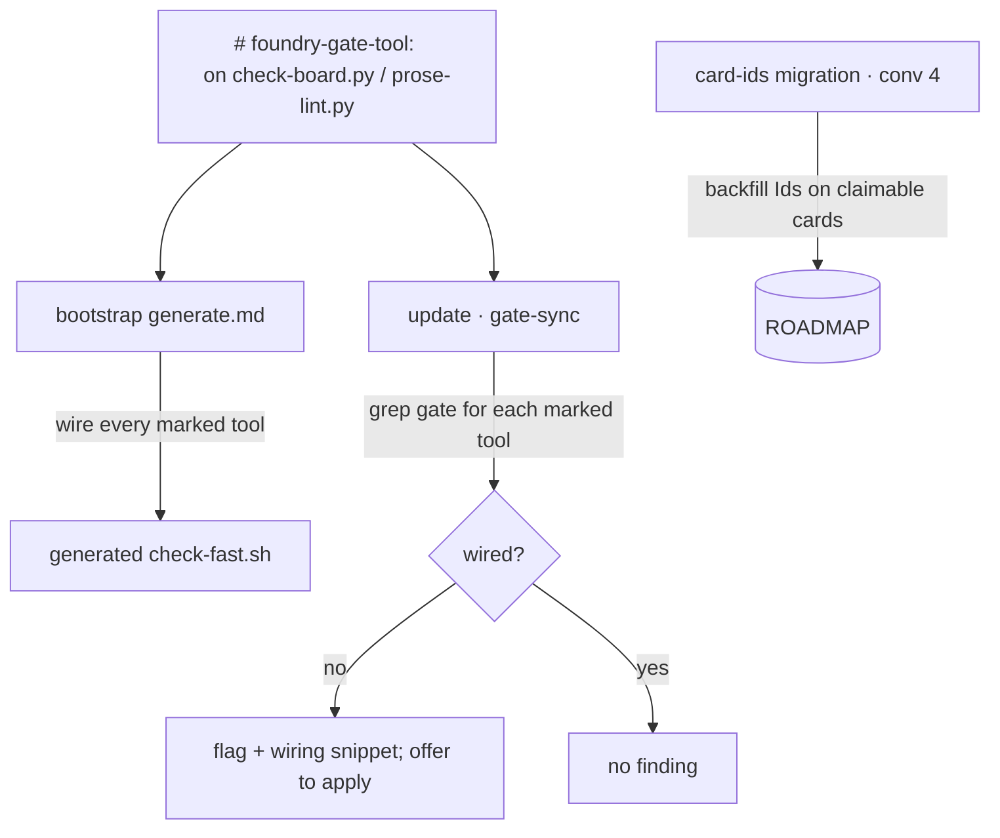

> **Status:** Planned (2026-06-28) — design pending approval; tracked on the [board](../../ROADMAP.md).
> Companion: [requirements.md](requirements.md), [tasks.md](tasks.md).

# Design — update-gate-sync

## Decisions

- **The marker is the single source of truth — kill the drift (the central call).** The bug is
  two hardcoded gate-tool lists that disagree: `generate.md` wires `check-board.py` but forgot
  `prose-lint.py`, and `update` wires nothing. A `# foundry-gate-tool: <invocation>` marker on
  the script itself makes "this belongs in the gate" travel *with* the file — the marker is the
  tool's **literal gate line**, so even prose-lint's `! -name index.md` exclusion travels intact;
  both `generate.md` (wire every marked tool) and `update` (verify every marked tool is wired)
  read the same source.
  A future gate tool needs only the marker. **Rejected: a curated list in the migration registry
  or the skills** — that is exactly the drift we are removing, and it would desync again the next
  time a tool ships. The marker mirrors the existing `foundry-template:` / `foundry-seed:`
  markers, so it is the repo's idiom, not a new mechanism.
- **Update flags, and offers — never silently edits — the gate.** The gate is repo-owned content
  (mechanisms-not-content) and may be customized. `gate-sync` greps the named gate command for
  the tool's basename and, if absent, reports the wiring snippet; it applies the edit only on the
  caller's go-ahead, consistent with `update`'s standing "ask before committing."
- **Wiring and Id-backfill are separate concerns.** `gate-sync` (standing, every run) wires the
  *tool* into the gate. The `card-ids` migration does the one thing wiring can't — backfill the
  `Id`s an existing board lacks, without which `check-board.py` fails even when wired. So a
  convention-3 consumer crossing to 4 gets Ids backfilled (migration) and the new gate checks
  surfaced (gate-sync) — together they close the loop.
- **`gate-sync` is repo- and harness-agnostic.** It reads the gate command from `AGENTS.md`
  Commands (which `update` already parses) and matches by script basename — no assumption about
  the gate's shape beyond "it names the script it runs."

## Mechanism

| Surface | Change |
|---|---|
| `scripts/check-board.py`, `scripts/prose-lint.py` (+ verbatim twins) | Add the `# foundry-gate-tool:` marker (twins stay byte-identical). |
| `plugins/foundry/skills/bootstrap/references/generate.md` | Derive the gate's tool list from the markers (wire every marked tool); fixes the `prose-lint.py` omission. |
| `plugins/foundry/skills/update/SKILL.md` | A `gate-sync` step (in §6 Report / §7 Verify): for each installed marked gate tool, check the gate; flag + snippet the unwired ones; offer to apply. |
| `plugins/foundry/skills/update/references/migrations/` | New `card-ids.md` playbook (convention 4) + a registry row; bump the head. |
| `.foundry/manifest.json` (foundry's own) | Stamp `conventionVersion: 4`. |
| `tests/` | A `gate-sync` test: an unwired marked tool is flagged, a wired one is not; the `card-ids` detector fires on a pre-`Id` board and is idempotent. |

## Metrics

Discrimination, not green-ness: the `gate-sync` test seeds a gate missing a marked tool → flagged
with its snippet; a gate that runs it → not flagged. The `card-ids` migration test backfills `Id`s
on a pre-`Id` fixture board so `check-board.py` flips fail→pass, and re-running the detector on the
result does not re-trigger. `gate-sync` is a grep over one file per tool — perf N/A.

## Out of scope

- Re-architecting the gate to auto-discover checks (e.g. a `gate.d/`); the marker + wire/verify is
  the lighter fix and keeps the gate a single readable script.
- Migrations for prior conventions already shipped (1–3); only the `card-ids` (4) break is new.
- Wiring non-gate scripts (the review machinery is plugin-side and auto-propagates).
