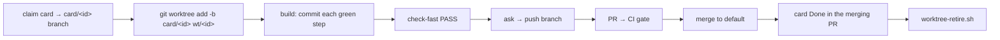

> **Status:** Draft (2026-06-27) — pending approval.
> Companion: [requirements.md](requirements.md), [tasks.md](tasks.md).

# Design — worktree-per-card

## Decisions

- **Worktree per card, not shared checkout.** Each card runs in its own
  `git worktree` on a `card/<id>` branch off the latest default branch. A shared primary
  checkout overloads one branch across parallel sessions and lets one agent's uncommitted
  work collide with another's. The worktree is the isolation unit; `worktree-retire.sh`
  (note-protection) is the teardown.
- **Commit freely; the push is the only ask.** Inside a worktree a commit is a private,
  recoverable checkpoint — not a published act — so the agent commits each green step and
  builds the spec's full scope confidently. The single outward, hard-to-reverse act is the
  **push**, so that is the only approval gate. This narrows the prior "ask before every
  commit" to "ask before push," and is identical to lifecycle-autonomy's invariant AC-2.4.
- **Done = merged, not shipped.** A card is `Done` when its branch merges to the default
  branch with the required gate green. The merged PR's gate run *is* the recorded gate
  PASS, and branch protection guarantees it ran before merge — so `Done` cannot land
  without it. Release/version is a separate axis (deferred `Release` column;
  release-please/CHANGELOG today), which removes the Epic-0-vs-Epic-6 board inconsistency
  and the stranded-`Validating` problem (cards merged long ago never reconciled to `Done`).
- **Set `Done` in the merging PR.** The board lives in the repo, so the only way a status
  lands atomically with the merge is to edit it in the same PR. This avoids the
  second-PR-to-mark-Done friction and keeps `main`'s board honest at every merge.
- **`card/<id>` branch is the claim — one model for every repo.** The claim signal is the
  `card/<id>` branch's existence (`git worktree list` locally; the remote branch once
  pushed), never a commit to the default branch. This holds whether or not the default is
  protected, keeps claiming free of the merge-to-default go-ahead, and is exactly why
  card-ids gives each card a unique, slug-safe `Id`. Board-status edits ride the work's PR
  (AC-4.3), so they land atomically with the merge.

## Mechanism

The `code` skill carries the policy as prose (it is the lifecycle dispatcher); `AGENTS.md`,
the board conventions, the seed ROADMAP, and bootstrap `generate.md` carry the same rules
so every repo and harness inherits them. The lifecycle eval's canned prompt is updated to
match, and a static doc check guards the `Done = merged` wording against regression.

Touched surfaces (all context-resident prose + one eval + one guard):

| Surface | Change |
|---|---|
| `plugins/foundry/skills/code/SKILL.md` | Plan: create worktree off default; Build: checkpoint commits; Finish: commit in worktree, ask before push, `Done = merged` set in the PR, retire worktree. Reconciled with the autonomy-dial text already present. |
| `plugins/foundry/skills/code/references/worktree.md` | New disclosed-on-demand reference holding the full mechanics (claim model, commit-freely, Done=merged), so `SKILL.md` stays under its context budget. |
| `AGENTS.md` | Boundaries: worktree-per-card + commit-freely + ask-before-push. Task tracking: `Done = merged`. |
| `roadmap/ROADMAP.md` + seed `templates/seeds/roadmap/ROADMAP.md` | Board conventions: `Done = merged`; status flow `… → In progress → Done`; `Validating` reserved; claim-by-`card/<id>`-branch. |
| `plugins/foundry/skills/bootstrap/references/generate.md` | Boundaries + Task-tracking rows regenerated to match. |
| `evals/harness/lifecycle-eval.sh` | Canned prompt: runner provisions the worktree; commit freely, do not push. |
| a static doc check (existing `tests/` style) | Asserts the conventions/seed/`AGENTS.md` say `Done = merged` and carry no "shipped in vX" gate wording. |

## Metrics

Discrimination, not green-ness: the static doc check fails if any of the conventions, the
seed, or `AGENTS.md` regresses to "ask before commit" or "Done … shipped in v" gate
wording, and passes on the corrected docs. The lifecycle eval asserts a card's commits land
on its `card/<id>` branch (never the shared default) and that no push to the default branch
happens without a go-ahead. Runtime: doc check is a one-shot grep-class parse — perf N/A.

## Out of scope

- The `Release` column and the release-please-branch version-stamping step (separate
  follow-up feature).
- Resolving `Depends on` nicknames to ids (card-ids follow-up).
- Migrating existing **consumer** repos to the new wording (an `update` migration).
